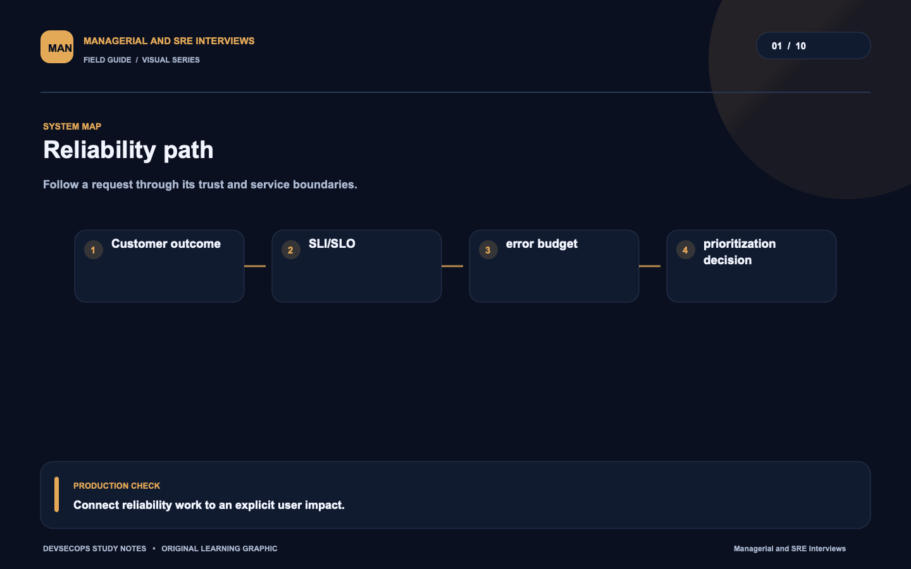
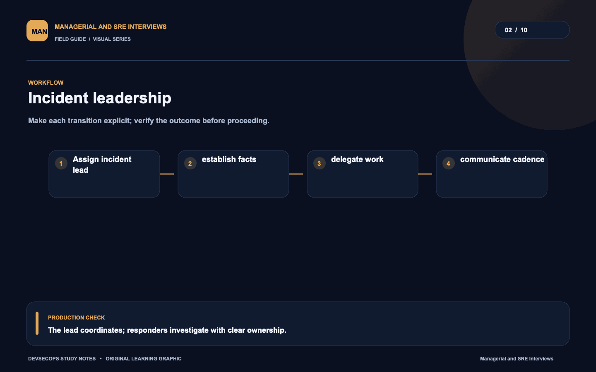
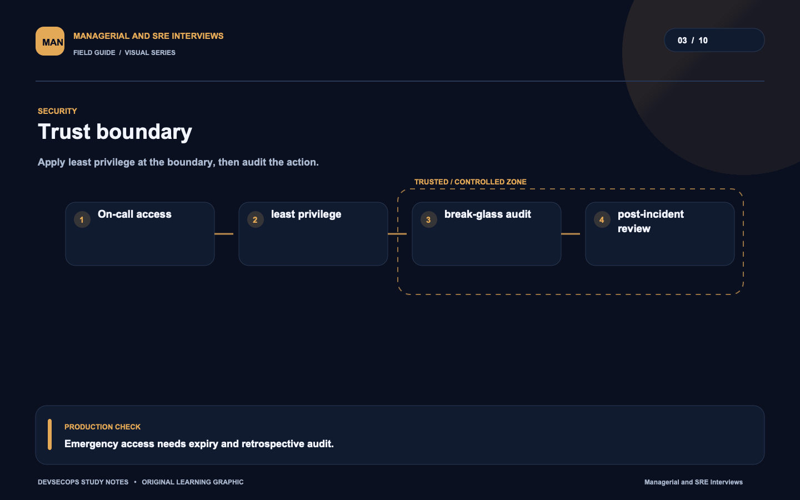
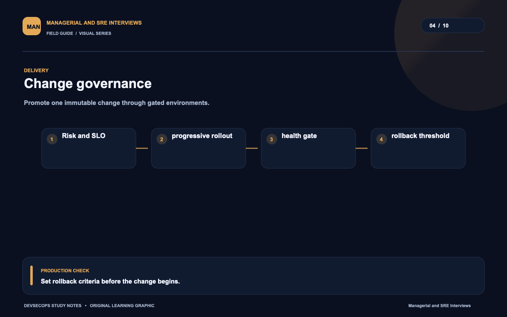
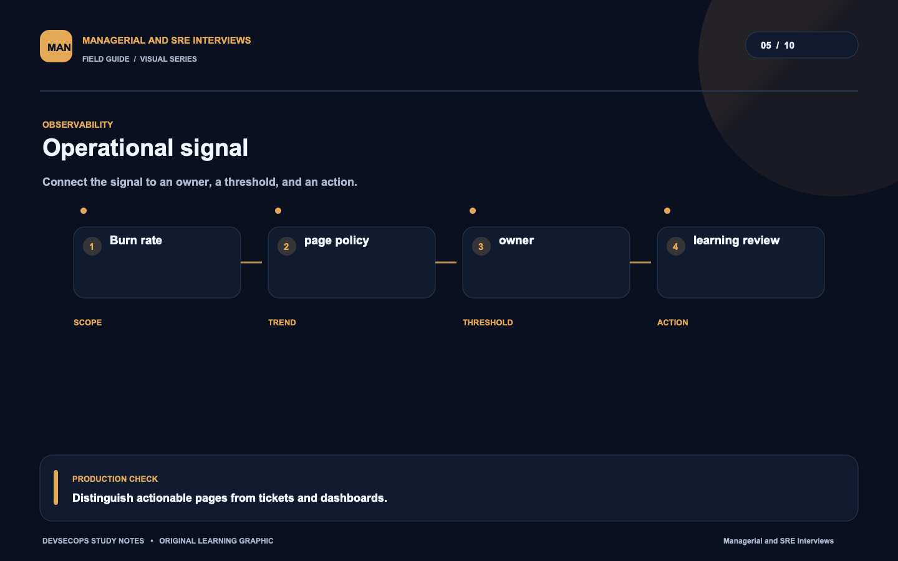
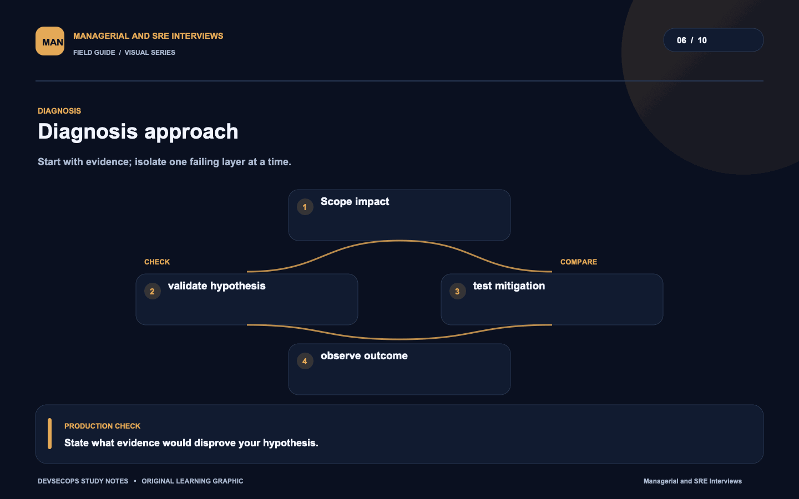
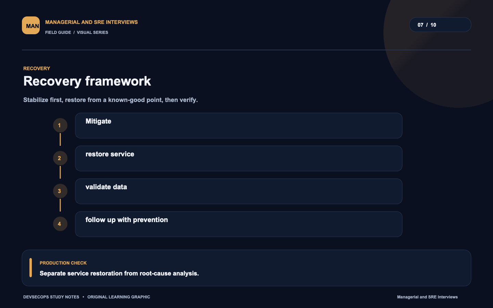
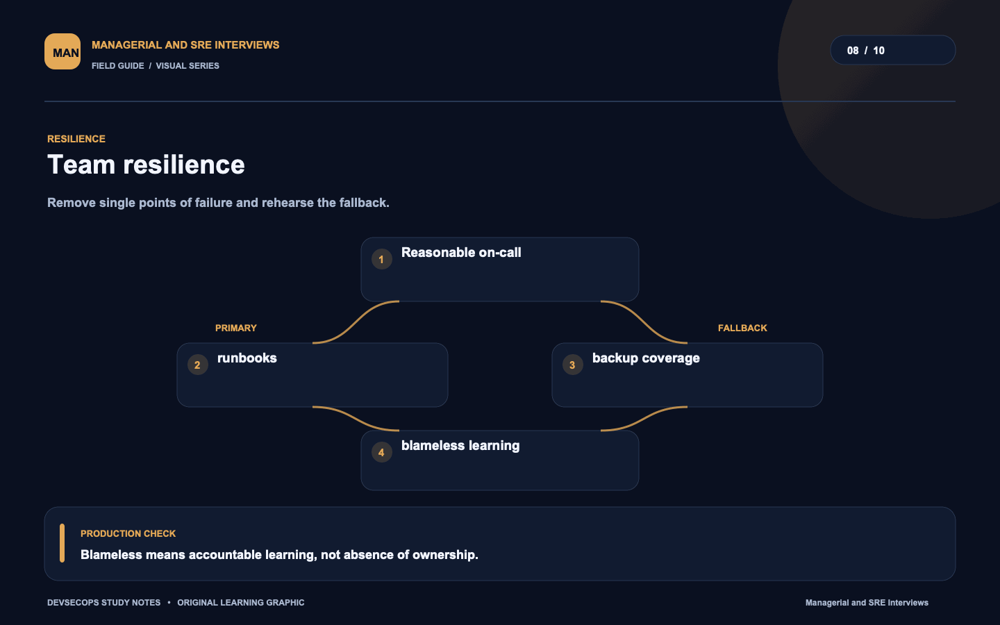
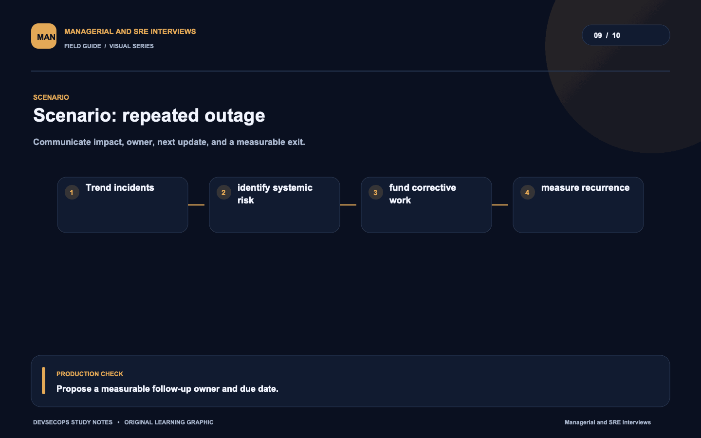
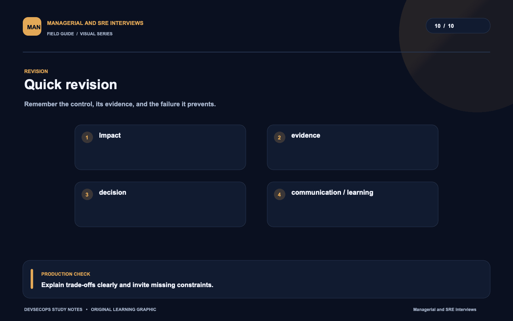

# Visual study cards

Ten original visuals for the [Managerial and SRE Interviews guide](../README.md). Open the SVG for a crisp, scalable version; use PNG for slides and quick viewing.

## 01. Reliability path

[SVG source](01-reliability-path.svg) · [PNG image](01-reliability-path.png)

## 02. Incident leadership

[SVG source](02-incident-leadership.svg) · [PNG image](02-incident-leadership.png)

## 03. Trust boundary

[SVG source](03-trust-boundary.svg) · [PNG image](03-trust-boundary.png)

## 04. Change governance

[SVG source](04-change-governance.svg) · [PNG image](04-change-governance.png)

## 05. Operational signal

[SVG source](05-operational-signal.svg) · [PNG image](05-operational-signal.png)

## 06. Diagnosis approach

[SVG source](06-diagnosis-approach.svg) · [PNG image](06-diagnosis-approach.png)

## 07. Recovery framework

[SVG source](07-recovery-framework.svg) · [PNG image](07-recovery-framework.png)

## 08. Team resilience

[SVG source](08-team-resilience.svg) · [PNG image](08-team-resilience.png)

## 09. Scenario: repeated outage

[SVG source](09-scenario-repeated-outage.svg) · [PNG image](09-scenario-repeated-outage.png)

## 10. Quick revision

[SVG source](10-quick-revision.svg) · [PNG image](10-quick-revision.png)
