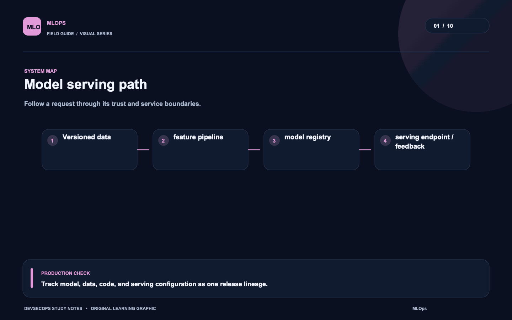
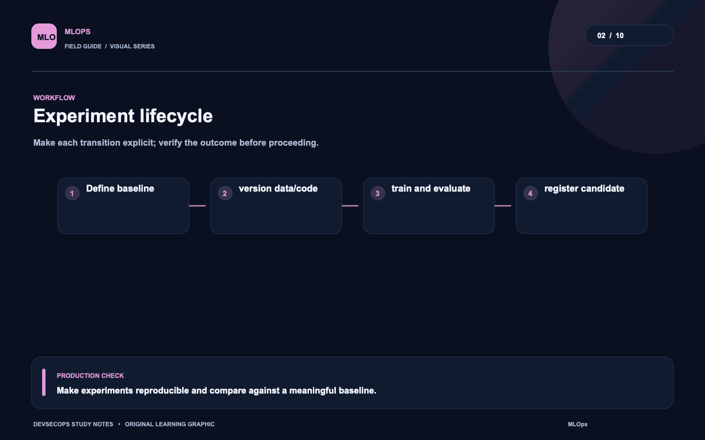
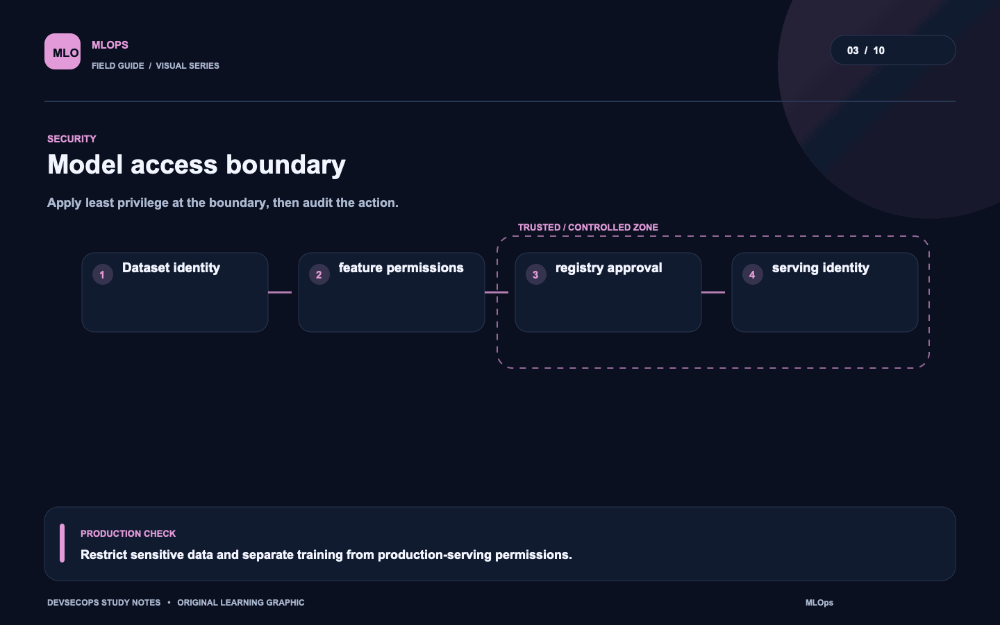
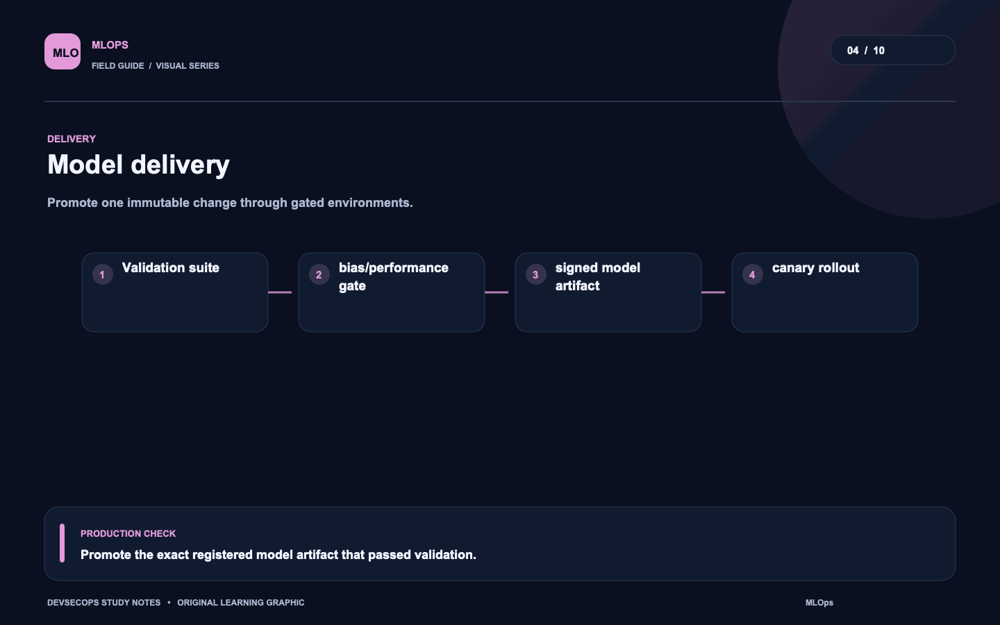
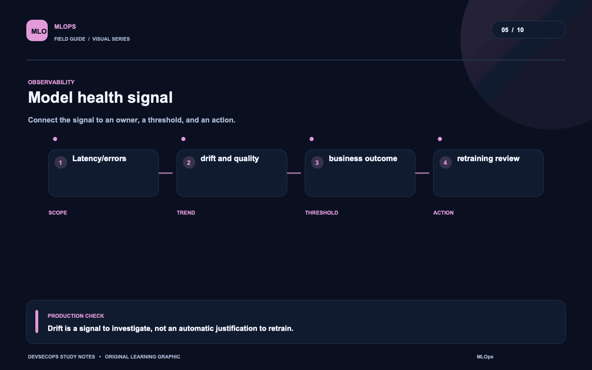
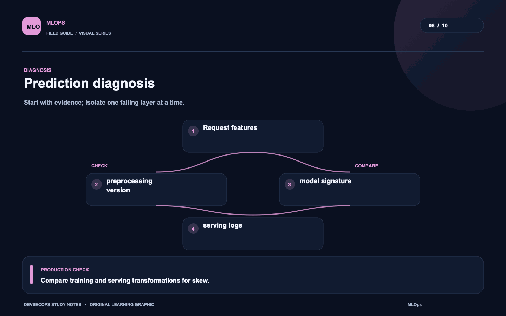
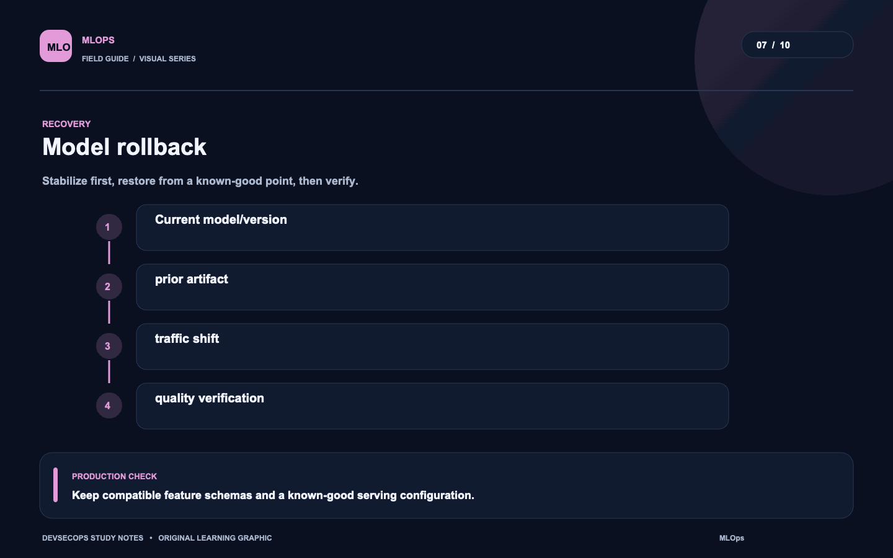
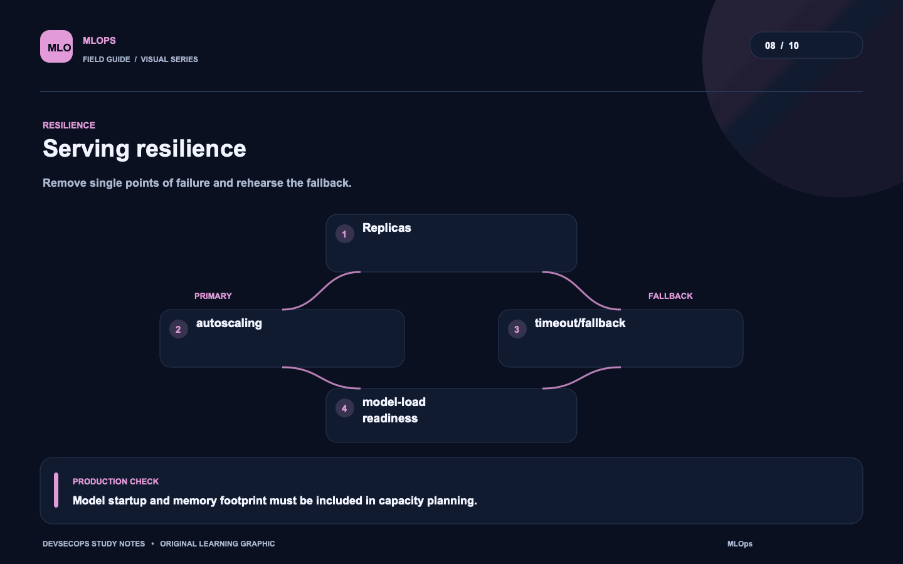
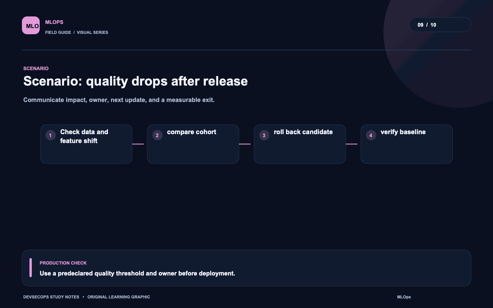
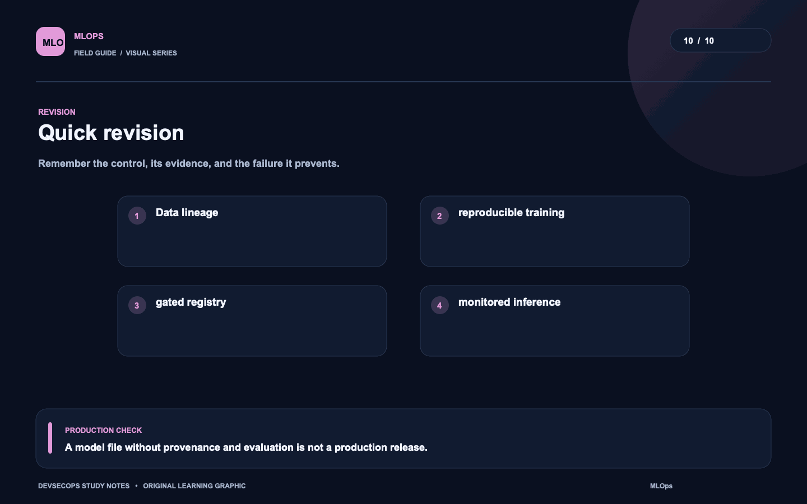

# Visual study cards

Ten original visuals for the [MLOps guide](../README.md). Open the SVG for a crisp, scalable version; use PNG for slides and quick viewing.

## 01. Model serving path

[SVG source](01-model-serving-path.svg) · [PNG image](01-model-serving-path.png)

## 02. Experiment lifecycle

[SVG source](02-experiment-lifecycle.svg) · [PNG image](02-experiment-lifecycle.png)

## 03. Model access boundary

[SVG source](03-model-access-boundary.svg) · [PNG image](03-model-access-boundary.png)

## 04. Model delivery

[SVG source](04-model-delivery.svg) · [PNG image](04-model-delivery.png)

## 05. Model health signal

[SVG source](05-model-health-signal.svg) · [PNG image](05-model-health-signal.png)

## 06. Prediction diagnosis

[SVG source](06-prediction-diagnosis.svg) · [PNG image](06-prediction-diagnosis.png)

## 07. Model rollback

[SVG source](07-model-rollback.svg) · [PNG image](07-model-rollback.png)

## 08. Serving resilience

[SVG source](08-serving-resilience.svg) · [PNG image](08-serving-resilience.png)

## 09. Scenario: quality drops after release

[SVG source](09-scenario-quality-drops-after-release.svg) · [PNG image](09-scenario-quality-drops-after-release.png)

## 10. Quick revision

[SVG source](10-quick-revision.svg) · [PNG image](10-quick-revision.png)
