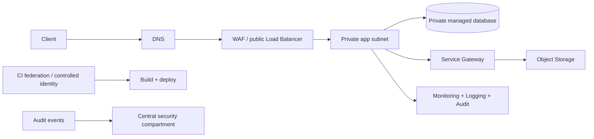

# Oracle Cloud Infrastructure (OCI): production engineering guide

## Chapter map

| Chapter | Scope |
|---|---|
| [Architecture and governance](architecture.md) | Tenancy, compartments, regions, guardrails, landing zone |
| [IAM and workload identity](iam-security.md) | Policies, dynamic groups, principals, Vault, Cloud Guard |
| [Networking](networking.md) | VCN, routing, gateways, NSGs, DRG, DNS, troubleshooting |
| [Compute and data services](compute-data.md) | Compute, OKE, Object/Block/File Storage, databases |
| [Delivery and operations lab](operations-lab.md) | Terraform, OCI DevOps, observability, recovery and verification |

OCI's services and feature support vary by region and tenancy. Check current OCI documentation, service limits, pricing, and availability before applying the patterns below. These are original notes, not a reproduction of the paid handbook.

## Production request path

## Learning path

Begin in a compartment for a non-production lab. Create the network and IAM controls before compute. Deploy an app with no secrets embedded in images, then test positive and negative access paths. Configure costs, alarms, backups, and a teardown plan before creating billable resources.

**Safety:** budgets/notifications may not cap expenditure; inspect the Cost Estimator and quotas, track all resource OCIDs/tags, and do not destroy shared tenancy/network resources during cleanup.

## Official references

[OCI Documentation](https://docs.oracle.com/en-us/iaas/Content/home.htm) · [OCI Architecture Center](https://docs.oracle.com/solutions/) · [OCI Cost Estimator](https://www.oracle.com/cloud/costestimator.html)

---

## Quick reference

| Need | Start here |
|---|---|
| Compartment or tenancy design | [Architecture](architecture.md) |
| Policy or workload identity | [IAM and security](iam-security.md) |
| VCN, gateway, or connection failure | [Networking](networking.md) |
| Compute, OKE, storage, database | [Compute and data services](compute-data.md) |
| IaC delivery, recovery, operations lab | [Delivery and operations](operations-lab.md) |

**Revision:** tenancy is root; compartment scopes organization/policy; policies authorize; routes and security rules control different network layers; NAT is egress, IGW supports public paths, Service Gateway reaches supported Oracle services; backup must be independently protected and restore-tested.

## Create and operate a VM

For OCI Compute use cases, launch prerequisites, private instance CLI flow, Bastion access, identity, verification, troubleshooting, and termination, follow [`vm-instance.md`](vm-instance.md).
