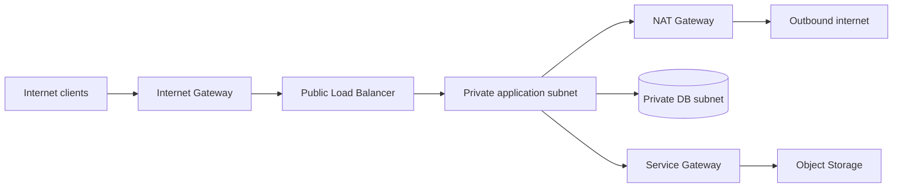

# Oracle Cloud Infrastructure (OCI) for DevOps

## Mental model and topic roadmap

OCI resources live in a tenancy, organized by compartments. Regions contain Availability Domains (where available) and Fault Domains; resource scope varies by service. Identity domains, IAM policies, networking, compute, storage, managed databases, container services, observability, and DevOps services form the main operating toolkit. OCI Console, CLI, SDKs, APIs, Resource Manager (Terraform), and DevOps service pipelines are interfaces to the same resource control plane.

### Identity and compartments

OCI policies grant groups/dynamic groups permission over resources in compartments. A policy such as `Allow group PlatformAdmins to manage virtual-network-family in compartment Platform` is broad: narrow verbs/resource families and compartment scope to the task. Instance principals and resource principals provide workload identity without embedding user API keys. Apply tags for ownership and cost; tags are not access control.

### Networking architecture

A VCN contains regional subnets, route tables, security lists and/or Network Security Groups. Internet Gateway is for public internet paths, NAT Gateway enables outbound-only internet paths, Service Gateway provides private access to supported Oracle services, and DRG connects networks such as on-premises or peered VCNs. NSGs are workload-oriented virtual firewalls; verify both ingress and egress, subnet routes, DNS, and stateful return paths.

### Compute, containers, storage, databases

Compute instances provide VM control; OKE provides managed Kubernetes control-plane capabilities; Container Instances can run containers without managing Kubernetes. Object Storage is for objects, Block Volumes for attached block devices, and File Storage for shared file semantics. Autonomous Database and Base Database Service have distinct management/control trade-offs. Select based on workload, durability, availability, latency, and operational skill.

### IaC, delivery, and operations

Use Terraform/OCI Resource Manager with reviewed plans and protected state. OCI DevOps can host code repositories, build pipelines, deployment pipelines, and artifact delivery; external CI can also deploy using workload identity. Build and scan once, promote immutable artifacts, and gate production. OCI Monitoring, Logging, Logging Analytics, Notifications, Events, Audit, and alarms provide distinct signals; correlate change/audit events with application telemetry. Define backup policy, cross-region recovery, RTO/RPO, and run restore drills.

### Security and reliability

Use compartmentalization, least privilege, MFA, federation, Vault secrets/keys, encryption, Cloud Guard, Security Zones where their constraints fit, vulnerability scanning, and audit review. Limit public IPs and ingress; use Bastion rather than exposing administrative ports. Understand service limits and quotas. Redundancy within a failure domain does not protect against account compromise or logical deletion; isolate and test backups.

### Worked scenario: private application cannot access Object Storage

1. Confirm workload identity: instance/resource principal or dynamic-group rule matches the intended instance.
2. Confirm policy grants the needed Object Storage verb in the correct compartment/tenancy.
3. Confirm DNS/service endpoint and route through the Service Gateway (or intended NAT path).
4. Check NSG/security-list egress and subnet route rules.
5. Inspect service logs and audit events; distinguish authorization denial from timeout.
6. Fix the narrowest missing permission/path and retest. Do not make the bucket public.

### Troubleshooting quick table

| Symptom | First checks |
|---|---|
| SSH unreachable | Instance state, public/private address, route table, IGW/DRG path, NSG/security-list ingress, host firewall, Bastion/session configuration |
| Instance has no outbound access | Private subnet route to NAT, NAT route/availability, NSG egress, DNS, destination policy |
| Load balancer backend unhealthy | Backend port/protocol, NSG paths, listener/probe path, app bind address, TLS and health response |
| Terraform cannot update | Provider/auth context, tenancy/region, policy, state lock, service limit, and exact API error |
| Unexpected bill | Cost analysis by compartment/tag, idle compute/block volumes, data egress, logging retention, and unattached resources |

### Revision

Tenancy is the root administrative boundary; compartments organize and scope policy; policies grant IAM permissions; VCN is regional; subnets are regional or availability-domain-specific depending on configuration; Security Lists attach at subnet level, NSGs at VNIC/resource level; Service Gateway is private access to supported Oracle services, NAT is outbound internet, and IGW enables public internet routing.

## Practice lab

In a non-production tenancy, create a compartment and VCN with public load balancer and private app/database subnets. Give a workload a dynamic-group policy scoped to one object bucket. Deploy with Terraform, emit logs/metrics, trigger an alarm, and demonstrate that the workload cannot read a different compartment's bucket. Tear down only after preserving any required state and evidence.

## Further reading

[OCI documentation](https://docs.oracle.com/en-us/iaas/Content/home.htm) · [OCI Architecture Center](https://docs.oracle.com/solutions/) · [OCI IAM policies](https://docs.oracle.com/en-us/iaas/Content/Identity/Concepts/policies.htm) · [OCI networking](https://docs.oracle.com/en-us/iaas/Content/Network/Concepts/overview.htm)
