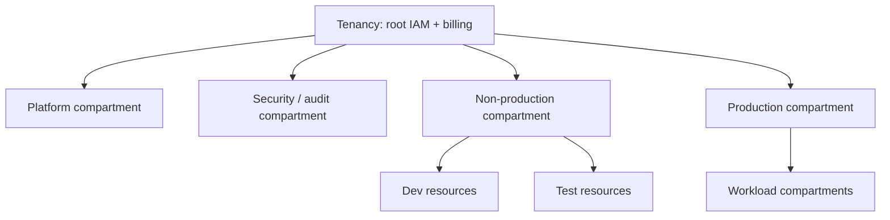

# OCI architecture and tenancy foundations

## Resource hierarchy



Compartments are logical IAM/cost/organization scopes, not independent tenancies. Policies can be inherited; changes at tenancy scope have broad impact. Define ownership, naming, quotas, tag namespaces, and policy administration before teams create resources. Use compartment hierarchy to express lifecycle and blast-radius boundaries; do not create deep trees without an access/cost governance purpose.

## Region, Availability Domain, Fault Domain

Regions are geographic OCI locations. Availability Domains (ADs) are present only in some regions; within an AD, Fault Domains provide hardware fault isolation. Many regions use different topology. Services can be regional, AD-specific, or global in scope; verify per resource. A multi-AD or multi-region design must account for dependencies, replication semantics, latency, DNS, and failover operations.

For each stateful service document:

- Failure domain and redundancy mode
- Replication/consistency behavior
- RPO/RTO target and authoritative failover operator
- Backup location, retention, immutability/deletion controls
- Tested restore procedure and evidence

Redundancy does not protect from logical corruption, credential compromise, or deletion propagation.

## Landing-zone checklist

1. Secure tenancy administrators with MFA and least privilege; establish audited break-glass access.
2. Configure federation/identity domains and group-based access.
3. Define compartments, tag defaults, and policy ownership.
4. Centralize audit logs and security findings in a protected compartment.
5. Define allowed regions/resource types, public-resource guardrails, and network ownership.
6. Configure cost tracking, budgets/alerts, quotas, and operational contacts.
7. Provision network and shared services through reviewed IaC.
8. Set backup, incident response, vulnerability management, and resource decommissioning standards.

Do not apply Security Zones blindly to an existing application: their enforced requirements can make noncompliant resources impossible to create or modify. Test policy effects and recovery paths first.

## Shared responsibility

Oracle operates the cloud infrastructure; customers still secure identities, workload configuration, data access, network paths, application code, and recovery. Managed database/OKE services reduce selected operations, not responsibility for workload IAM, upgrade policy, backups, and observability.

## Discovery commands

Use a named OCI CLI profile, explicit region, and compartment OCID. Protect config/API signing keys with OS permissions and rotation; prefer federation or resource principals for automation.

```bash
oci iam compartment list --compartment-id "$TENANCY_OCID" --all
oci iam availability-domain list --compartment-id "$TENANCY_OCID"
oci iam region list
oci limits quota list --compartment-id "$COMPARTMENT_OCID"
```

Do not paste API signing key material, auth tokens, or full credential files into logs/issues.

## Revision

Tenancy is the root; compartments scope organization and policy; AD/Fault Domain are distinct failure boundaries; resource scope differs by service; tags aid governance but are not authorization; budget notification is not a hard spend cap.
