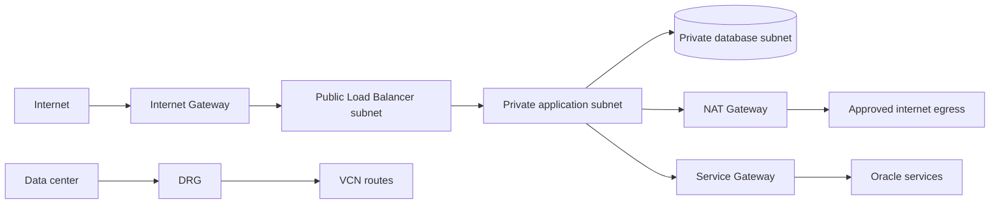

# OCI VCN networking and connectivity operations

## 1. Network design

VCNs are regional. Subnets can be regional or AD-specific depending on configuration. A route table chooses next hop; NSGs filter traffic at VNIC/resource level; Security Lists apply at subnet level. Both ingress and egress rules matter. Stateful rules track return traffic, but security posture still depends on scope, source, destination, and ports.

Internet Gateway supports public internet routing; NAT Gateway supports outbound-only internet traffic; Service Gateway provides private connectivity to supported Oracle services; DRG connects external networks/VCNs according to attachments and route tables. They are not interchangeable.

## 2. Address planning

Inventory CIDRs across VCNs, VPN/FastConnect, peering, Kubernetes Pods/services, and vendor networks before allocation. Avoid overlapping CIDRs. Define DNS zones/forwarding and routing ownership. Use NSGs to express workload-tier policy; keep Security List defaults reviewed and avoid broad ingress.

## 3. Hybrid and private endpoints

DRG route tables/import distributions and VCN route tables jointly determine reachability. VPN or FastConnect availability requires testing redundant paths, BGP, route propagation, MTU, asymmetric return routes, and DNS. Service Gateway does not provide generic access to arbitrary public services. Private endpoint support is service-specific.

## 4. Network diagnosis runbook

For each failing flow capture source/destination OCID/IP, port/protocol, timestamp, direction, and error type.

1. Verify workload state, VNIC/subnet, private/public IP, and DNS resolution.
2. Inspect route table for exact destination prefix and next hop.
3. Inspect NSG attached to the VNIC and subnet Security Lists; check ingress and egress.
4. Verify gateway/DRG attachment, route propagation, and remote return route.
5. Confirm target listener, host firewall, health probe, TLS, and service-side access rules.
6. Use flow/log/packet evidence supported by the path; confirm no firewall state is obscuring diagnosis.
7. Apply the narrowest rule and remove temporary diagnostics.

### Common symptoms

| Symptom | Likely first checks |
|---|---|
| SSH timeout | Route, public/private reachability, IGW/Bastion, NSG + Security List ingress, host firewall |
| Public LB backend unhealthy | Backend subnet path, NSG ingress from LB, health-check port/path/protocol, app bind address |
| Private VM cannot update packages | NAT route, NAT gateway, egress policy, DNS, proxy/repository reachability |
| OCI API call from private subnet fails | Service Gateway route/endpoint/DNS, NSG egress, IAM principal and policy |
| VPN up but traffic fails | DRG attachment/route tables, BGP prefixes, VCN route, return route, CIDR overlap |

## Revision

Route selects path; NSG/Security List permit/deny; DNS resolves names; gateway type matters; public IP does not imply working path; connectivity does not imply IAM permission.
