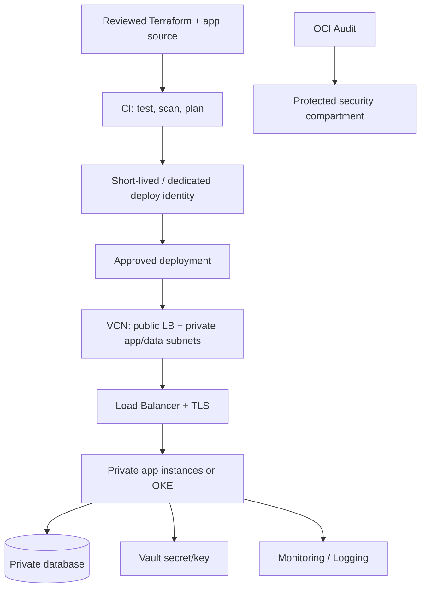

# OCI Terraform delivery and production operations lab

> Use a non-production compartment. Compute, load balancers, databases, NAT/data transfer, and logging may incur charges. Check current prices and quotas; notifications are not a guaranteed spending cap.

## Reference architecture



## Terraform workflow

Use OCI provider version constraints and commit the lock file. Keep state remote, encrypted, access-controlled, and backed up; state may contain secrets. Separate prod/non-prod state. Authenticate CI without a human API signing key when supported; otherwise use a dedicated principal, restricted key access, and rotation. Require reviewed plan and protected apply.

```bash
terraform fmt -check -recursive
terraform init -lockfile=readonly
terraform validate
terraform plan -out=tfplan
terraform show tfplan
# Apply the reviewed plan only through an approved workflow.
terraform apply tfplan
```

Use data sources and modules with explicit interfaces. Do not use `-target` as routine delivery, commit `terraform.tfvars` with secrets, or run `force-unlock` before checking active applies.

## Lab sequence

1. Create a dedicated compartment and assign a narrowly scoped operator group.
2. Create a VCN with public edge and private app/data subnet; route internet egress only where required.
3. Create workload identity and policy for one secret/object location.
4. Deploy a test app and verify it has no public instance IP.
5. Expose only HTTPS through the load balancer; configure health checks and TLS.
6. Add central Logging/Monitoring alarms and confirm Audit events are visible outside the workload compartment.
7. Test authorized and unauthorized API/data calls.
8. Document recovery and teardown before provisioning expensive stateful services.

## Production readiness gates

- **Security:** threat model, IAM review, no embedded credentials, vulnerability scan, exposed-port review.
- **Availability:** failure-domain placement, quota/capacity check, dependency timeout, health probes, failover plan.
- **Data:** encryption, retention, backup isolation, tested restore, data migration compatibility.
- **Operations:** dashboard, page threshold, runbook, ownership, maintenance window, change/rollback record.
- **Cost:** service estimate, tags, budget alert, idle cleanup, retention/egress review.

## Incident and recovery scenario

If a new release makes backends unhealthy, freeze promotion; inspect load balancer health details, NSG/security-list/route path, app logs, and deployment diff. Revert to a known-good artifact or compute image only after checking schema compatibility. Verify successful requests from an external client and internal data path. Preserve OCI request IDs and Audit evidence.

For data recovery, restore to an isolated target, verify integrity and access controls, measure achieved RPO/RTO, then plan a controlled cutover. Never test a restore by overwriting production data.

## Teardown

Inventory resources by compartment and lab tag/OCID. Preserve required logs/state first. Delete only lab-owned resources in dependency order; inspect shared VCN, DRG, Vault, buckets, and backups before deletion. Confirm detached volumes, public IPs, load balancers, databases, log retention, and artifact storage are handled.
