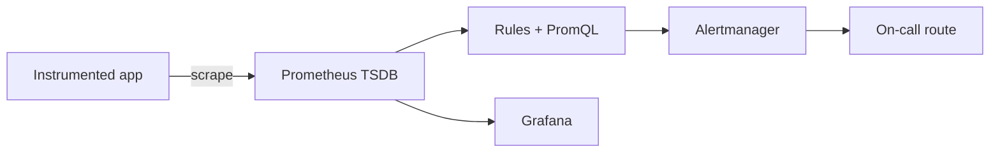

# Prometheus monitoring

## Mental model

Prometheus periodically scrapes HTTP endpoints that expose time-series samples. A series is identified by its metric name and label set. Prometheus stores samples locally and evaluates PromQL queries and alerting rules. Labels are powerful dimensions but unbounded values (user IDs, request IDs) create dangerous cardinality growth.

## Instrumentation and querying

Use counters for cumulative events, gauges for values that rise and fall, histograms for distributions, and summaries only when their trade-offs fit. Name metrics consistently and include units. Prefer labels with small, known value sets. Query rates from counters with `rate()` over an appropriate range; aggregate only after applying rate to each original counter series. Histograms enable bucket-based quantile estimates across instances.

Configure scrape targets, service discovery, relabeling, retention, and remote storage deliberately. Validate targets and rules before production. Avoid treating missing data as zero without understanding the distinction. Alert on user-visible symptoms and sustained conditions, then attach a runbook and owner.

## Reliability and security

Prometheus is not a high-availability or long-term archive by default. Plan replication/remote write and backup according to the deployment. Restrict access to query/admin endpoints and protect scrape credentials. Monitor Prometheus itself: scrape failures, ingestion, rule evaluation, disk use, and cardinality.

## Practice

Instrument a service with request count, error count, and latency histogram. Build queries for error ratio and latency, create an actionable alert, and demonstrate how a high-cardinality label can inflate series count.

## Further reading

[Prometheus documentation](https://prometheus.io/docs/introduction/overview/) · [PromQL](https://prometheus.io/docs/prometheus/latest/querying/basics/)

## Topic roadmap and alert example

**Collection:** instrumentation exports metrics; scrape configuration discovers targets; relabeling changes labels/target selection; TSDB stores samples; rule evaluation calculates recording/alerting rules; Alertmanager groups, deduplicates, routes, and inhibits notifications. Federation/remote write address particular scale or retention needs, not a substitute for capacity planning.

**PromQL:** a counter only increases (except reset), so apply `rate()`/`increase()` before aggregation. A gauge can rise or fall. Histograms expose bucket counters that can be aggregated across instances; quantiles from summaries generally cannot. Every unique label combination creates another series; never label with request IDs, user IDs, or arbitrary URLs.

Example error ratio: `sum(rate(http_requests_total{status=~"5.."}[5m])) / sum(rate(http_requests_total[5m]))`. Guard against absent/zero traffic and ensure numerator/denominator represent the same population.

**Troubleshooting:** target down—DNS, route, TLS/auth, endpoint path and timeout; missing series—scrape labels, metric name, exporter and time range; alert not firing—rule evaluation, labels, pending duration, absent data; disk growth—cardinality, retention, WAL and block size.

**Revision:** metric type informs query; labels define series identity; `rate` handles resets per series; alert on symptoms with a runbook; scrape success is not service health; monitor Prometheus itself and plan retention/backup.
