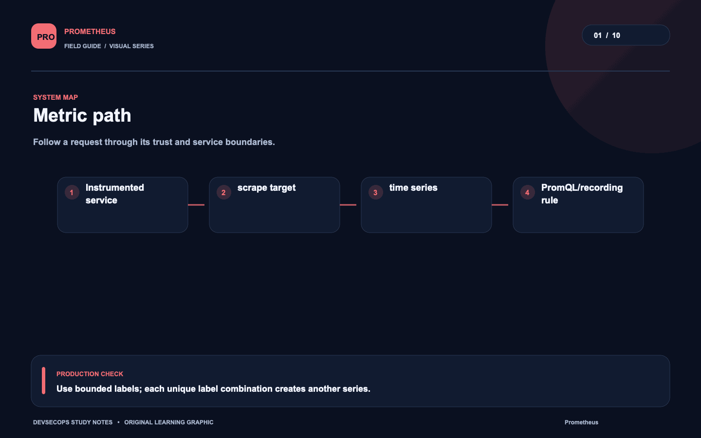
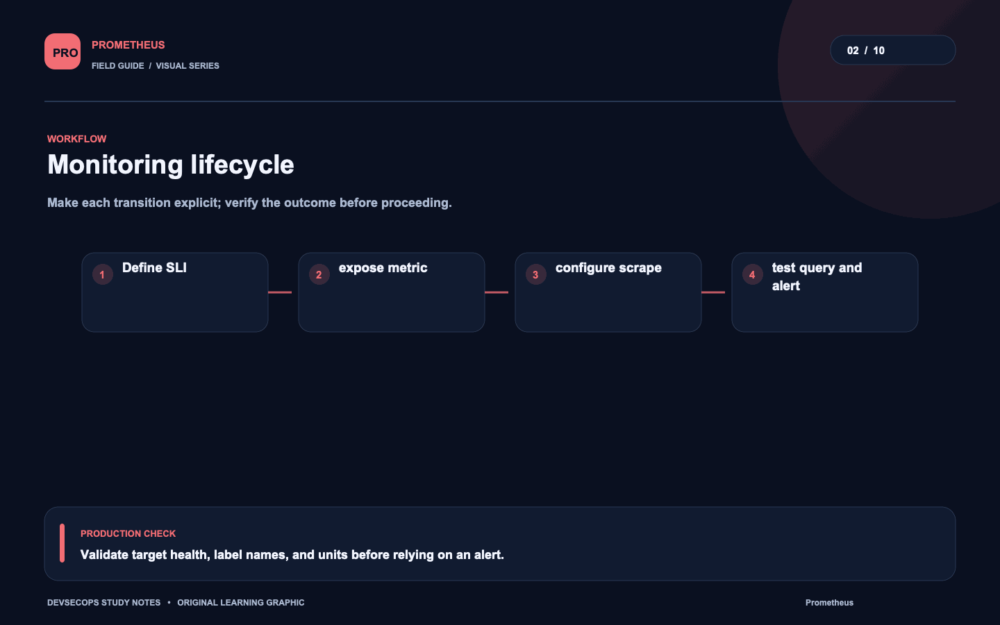
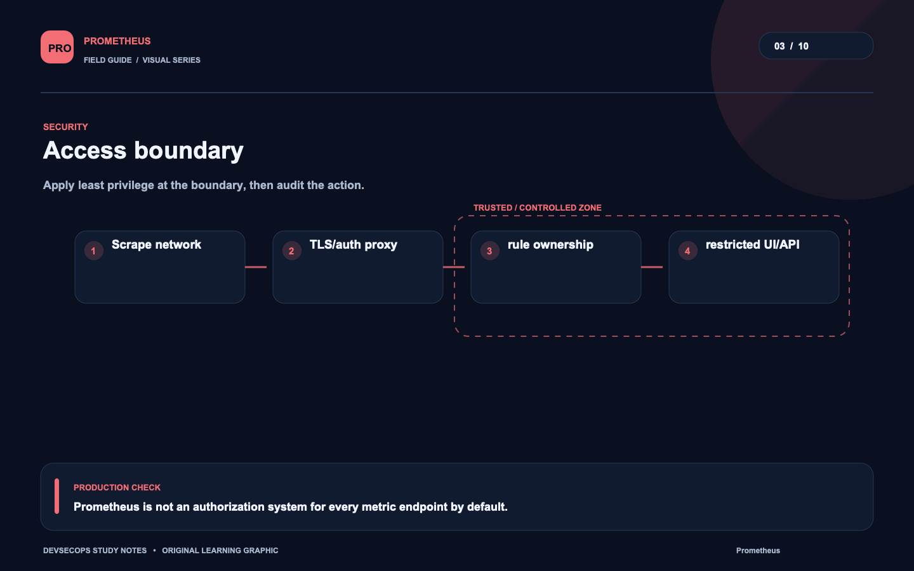
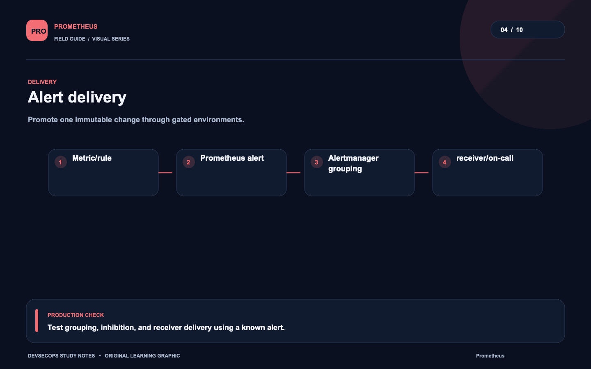
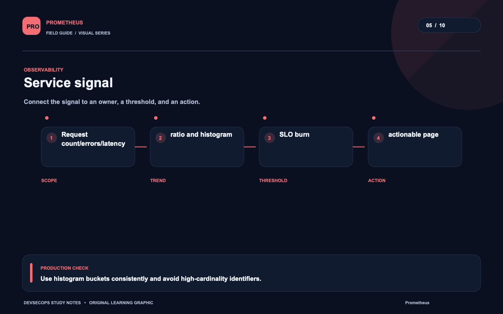
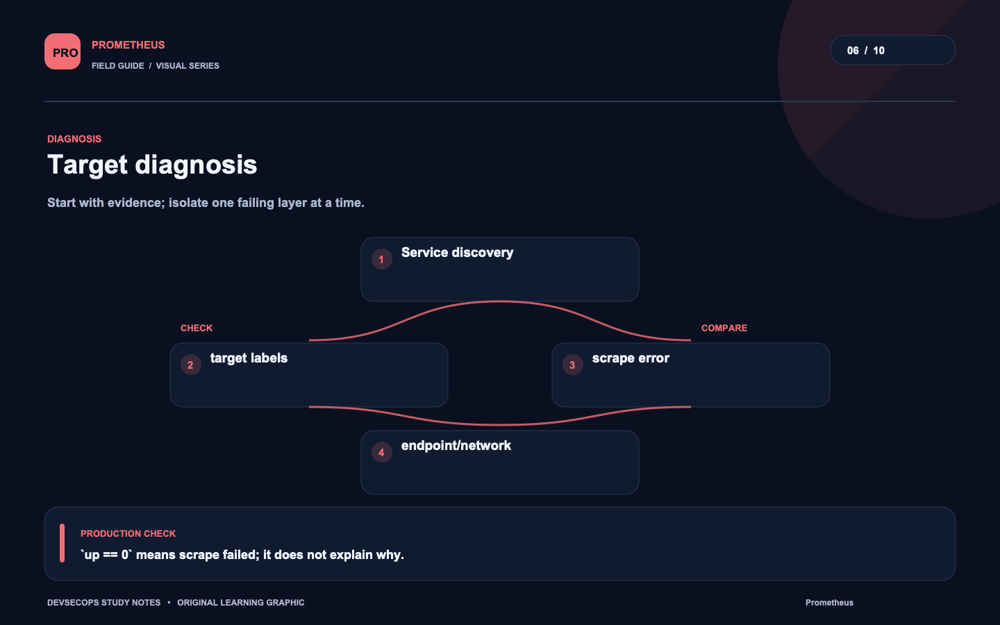
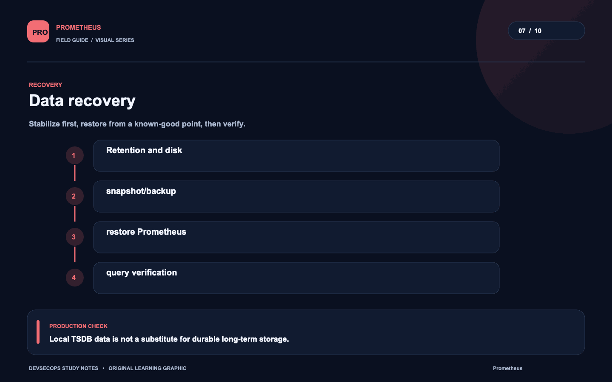
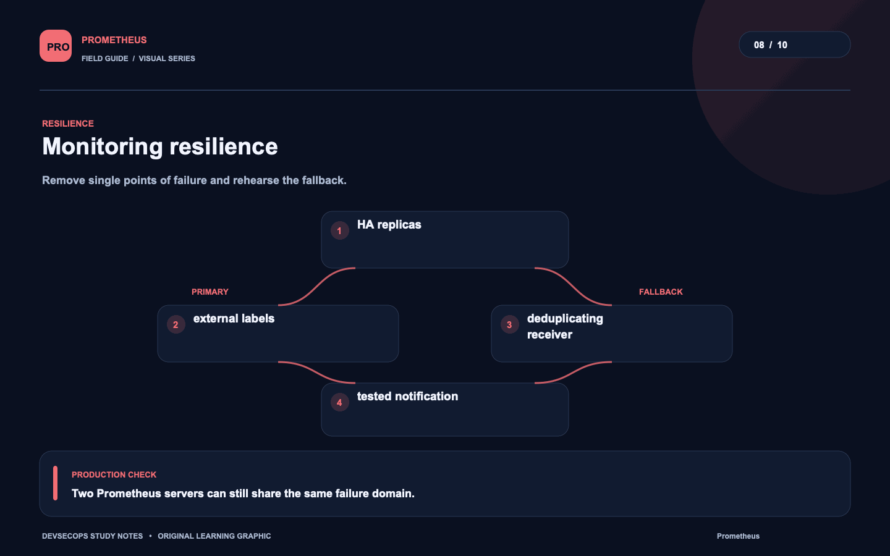
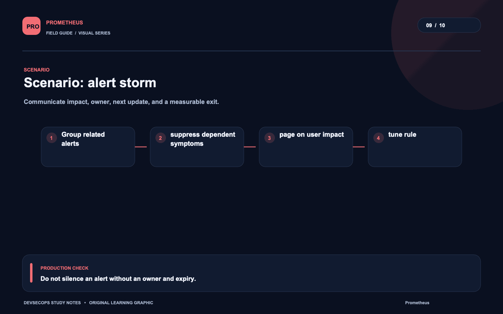
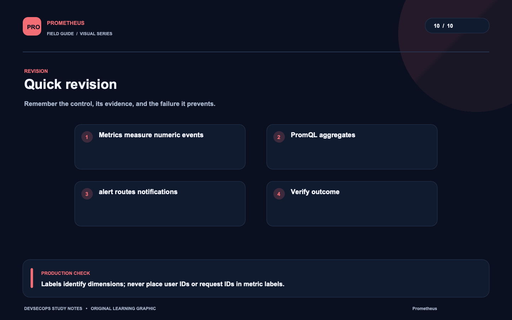

# Visual study cards

Ten original visuals for the [Prometheus guide](../README.md). Open the SVG for a crisp, scalable version; use PNG for slides and quick viewing.

## 01. Metric path

[SVG source](01-metric-path.svg) · [PNG image](01-metric-path.png)

## 02. Monitoring lifecycle

[SVG source](02-monitoring-lifecycle.svg) · [PNG image](02-monitoring-lifecycle.png)

## 03. Access boundary

[SVG source](03-access-boundary.svg) · [PNG image](03-access-boundary.png)

## 04. Alert delivery

[SVG source](04-alert-delivery.svg) · [PNG image](04-alert-delivery.png)

## 05. Service signal

[SVG source](05-service-signal.svg) · [PNG image](05-service-signal.png)

## 06. Target diagnosis

[SVG source](06-target-diagnosis.svg) · [PNG image](06-target-diagnosis.png)

## 07. Data recovery

[SVG source](07-data-recovery.svg) · [PNG image](07-data-recovery.png)

## 08. Monitoring resilience

[SVG source](08-monitoring-resilience.svg) · [PNG image](08-monitoring-resilience.png)

## 09. Scenario: alert storm

[SVG source](09-scenario-alert-storm.svg) · [PNG image](09-scenario-alert-storm.png)

## 10. Quick revision

[SVG source](10-quick-revision.svg) · [PNG image](10-quick-revision.png)
