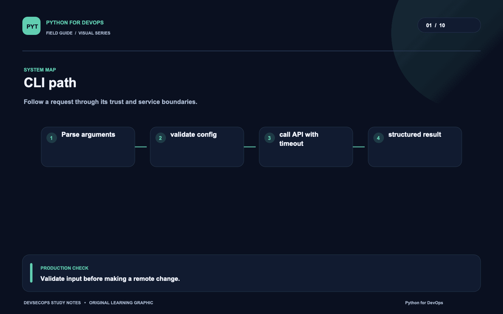
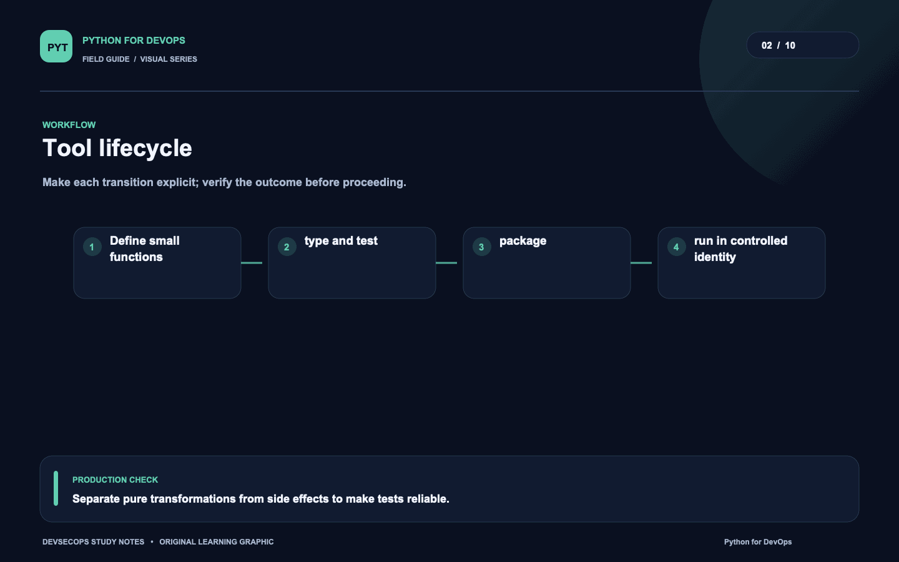
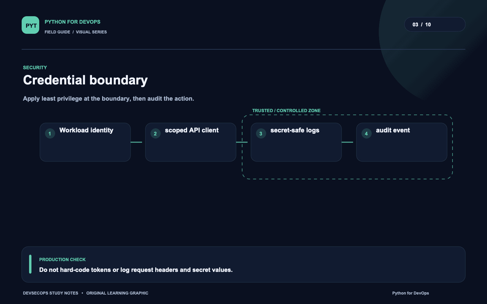
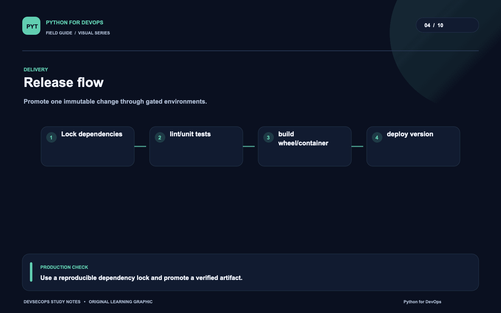
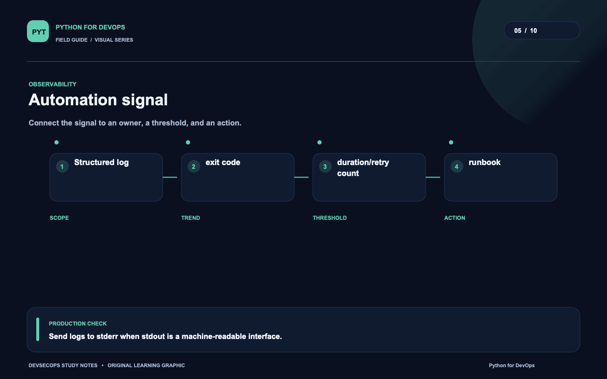
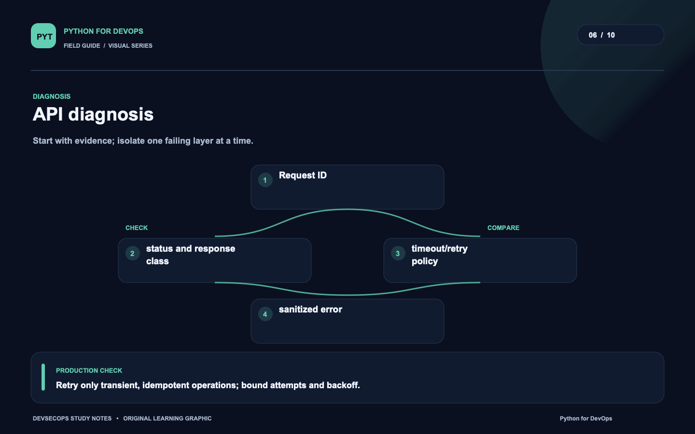
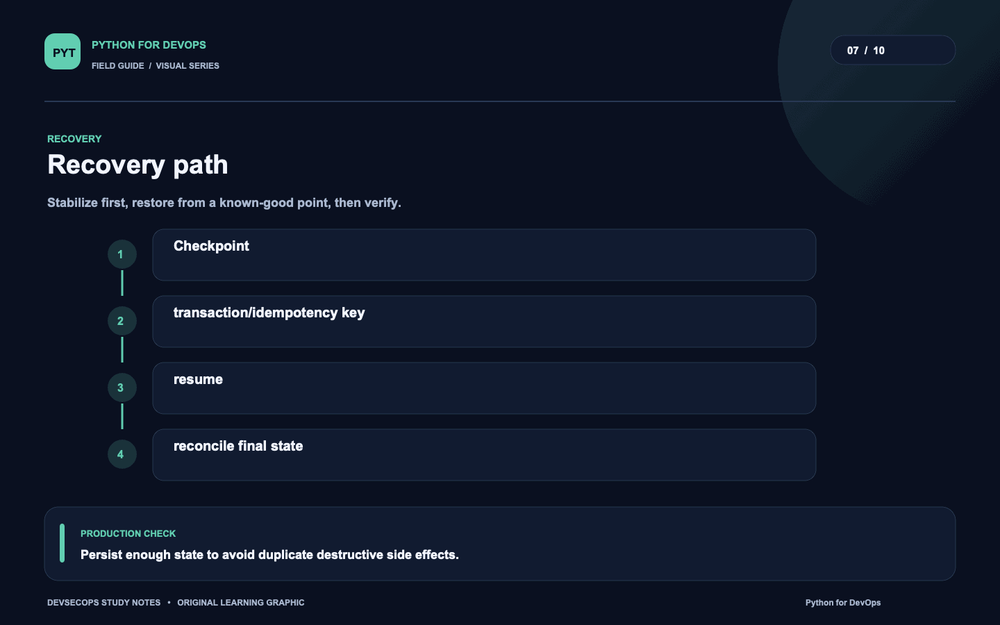
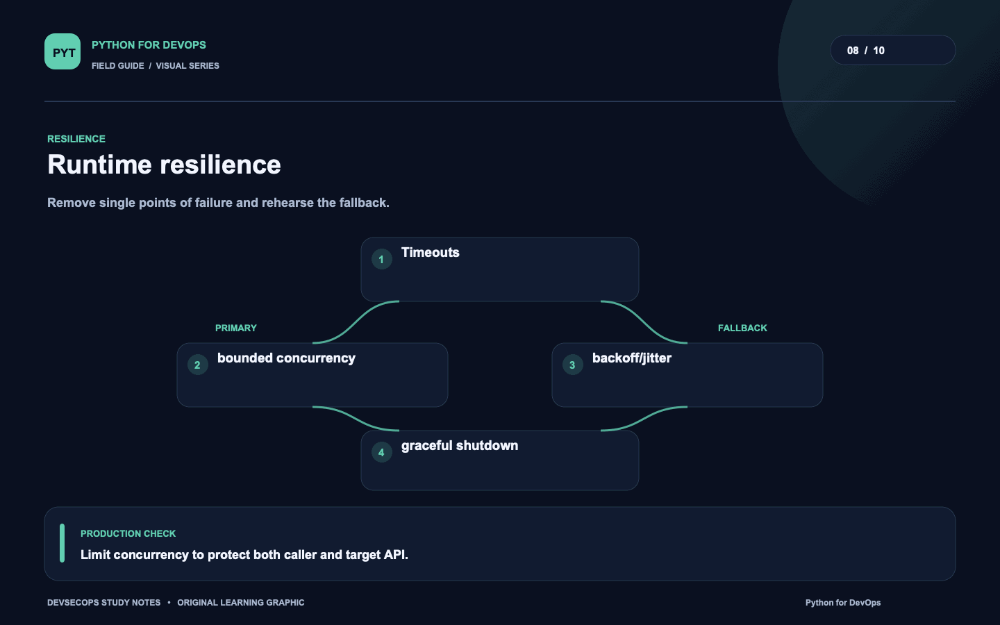
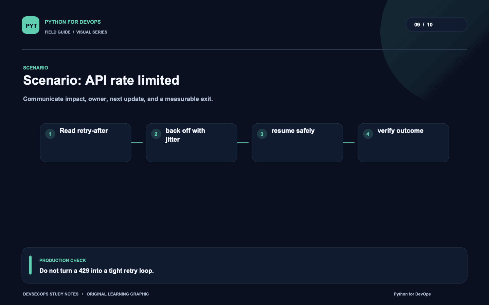
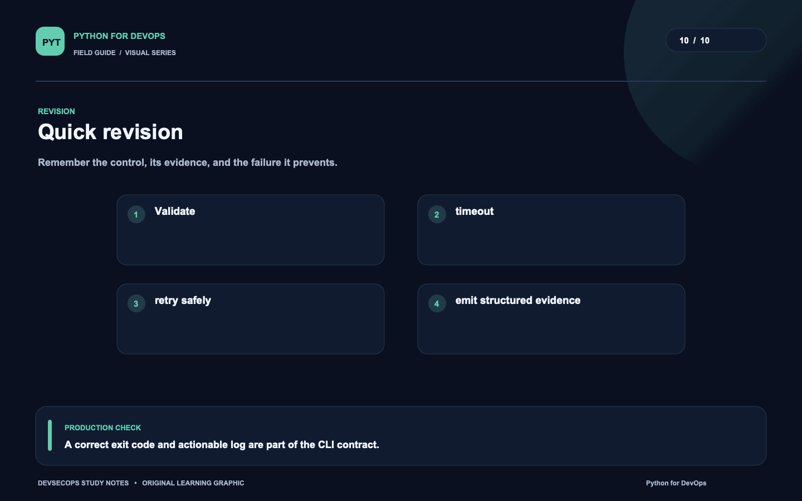

# Visual study cards

Ten original visuals for the [Python for DevOps guide](../README.md). Open the SVG for a crisp, scalable version; use PNG for slides and quick viewing.

## 01. CLI path

[SVG source](01-cli-path.svg) · [PNG image](01-cli-path.png)

## 02. Tool lifecycle

[SVG source](02-tool-lifecycle.svg) · [PNG image](02-tool-lifecycle.png)

## 03. Credential boundary

[SVG source](03-credential-boundary.svg) · [PNG image](03-credential-boundary.png)

## 04. Release flow

[SVG source](04-release-flow.svg) · [PNG image](04-release-flow.png)

## 05. Automation signal

[SVG source](05-automation-signal.svg) · [PNG image](05-automation-signal.png)

## 06. API diagnosis

[SVG source](06-api-diagnosis.svg) · [PNG image](06-api-diagnosis.png)

## 07. Recovery path

[SVG source](07-recovery-path.svg) · [PNG image](07-recovery-path.png)

## 08. Runtime resilience

[SVG source](08-runtime-resilience.svg) · [PNG image](08-runtime-resilience.png)

## 09. Scenario: API rate limited

[SVG source](09-scenario-api-rate-limited.svg) · [PNG image](09-scenario-api-rate-limited.png)

## 10. Quick revision

[SVG source](10-quick-revision.svg) · [PNG image](10-quick-revision.png)
