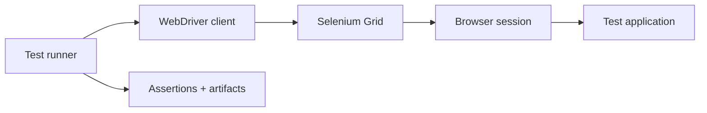

# Selenium automation testing

## Mental model

Selenium WebDriver automates a browser through standardized commands. A test locates elements, performs user-like actions, and asserts observable behavior. Stable tests interact through accessible user-facing interfaces rather than brittle implementation details.

## Test design

Use explicit waits for meaningful conditions instead of fixed sleeps. Prefer stable IDs, accessible roles/labels, and deliberate test attributes over deeply nested CSS/XPath selectors. Keep tests isolated: create their own data, avoid order dependence, and clean up safely. Separate page/component helpers from assertions without hiding what a test actually verifies. Cover critical user journeys, not every possible permutation through the browser.

Run browsers in a controlled local or remote environment (for example, a Selenium Grid). Pin compatible browser/driver versions or use a managed setup. Capture screenshots, browser logs, and useful diagnostics on failure, while redacting tokens and personal data. Parallel execution requires isolated test data and sufficient grid capacity.

## CI and reliability

Use headless execution where appropriate, but keep browser, fonts, locale, timezone, and network dependencies predictable. Classify failures as product defects, test defects, infrastructure issues, or flaky timing. Retry only with care: retries can hide real regressions. Track flake rate and remove unstable tests from release gates until fixed.

## Practice

Automate login and a key transaction against a test environment, using explicit waits and independent seeded data. Run it repeatedly and in parallel; collect artifacts on failure and verify credentials never appear in logs.

## Further reading

[Selenium documentation](https://www.selenium.dev/documentation/)

## Topic roadmap, example, and failure diagnosis

**WebDriver topics:** browser/driver session lifecycle, locators, interactions, navigation, waits, frames/windows, cookies/storage, screenshots, Grid, and browser capabilities. WebDriver BiDi adds event-oriented browser communication where supported. Test behavior through user-facing semantics and keep page helpers thin.

**Java/TestNG/Maven framework notes:** Maven dependencies and Surefire configuration define reproducibility; TestNG supports fixtures, groups, data providers, and parallel execution. Isolate driver lifecycle per test/thread, close sessions reliably in teardown, and keep secrets in CI secret management. Do not share browser state between parallel tests.

**Wait example:** wait for a named element to be clickable or a specific URL/state; avoid `Thread.sleep` as synchronization. Use stable accessible labels/IDs and explicit test data. For CI, pin browser/driver versions, capture screenshot and console/network context on failure, and redact credentials.

**Troubleshooting:** element not found—wrong frame/window, stale locator, changed DOM or timing; click intercepted—overlay/scroll/animation; flaky CI—resource contention, data collision, timezone/locale, network or implicit/explicit wait mix; session cannot start—browser/driver capability mismatch or Grid capacity.

**Revision:** explicit waits for conditions; tests isolated and repeatable; retries can mask product defects; page objects should not hide assertions; Grid is a capacity and trust boundary; failures need useful artifacts without secret leakage.

## Java/TestNG example project

See [`examples/java-testng/`](examples/java-testng/) for a Maven test with explicit wait, per-test browser lifecycle, optional Selenium Grid, and failure screenshot. It expects an application contract: a page element with `data-testid="service-status"` and accessible text `ready`. Adapt locators to your app. Screenshots may contain customer data; retain them only under approved CI artifact controls.

## End-to-end browser-test process

See [`process.md`](process.md) for environment/test-data preparation, browser/Grid startup, deterministic test execution, failure artifacts, CI triage, flake reduction, and cleanup.
