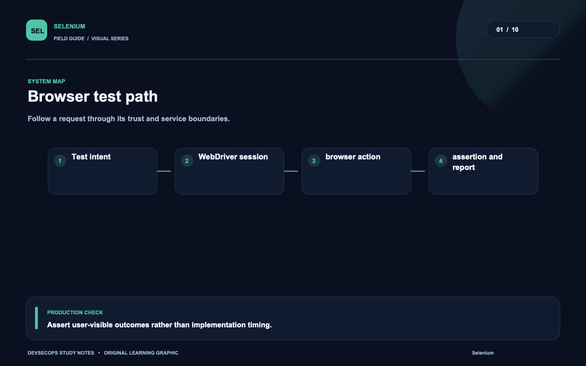
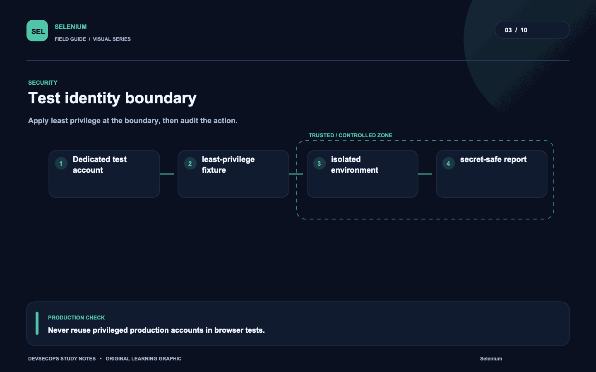
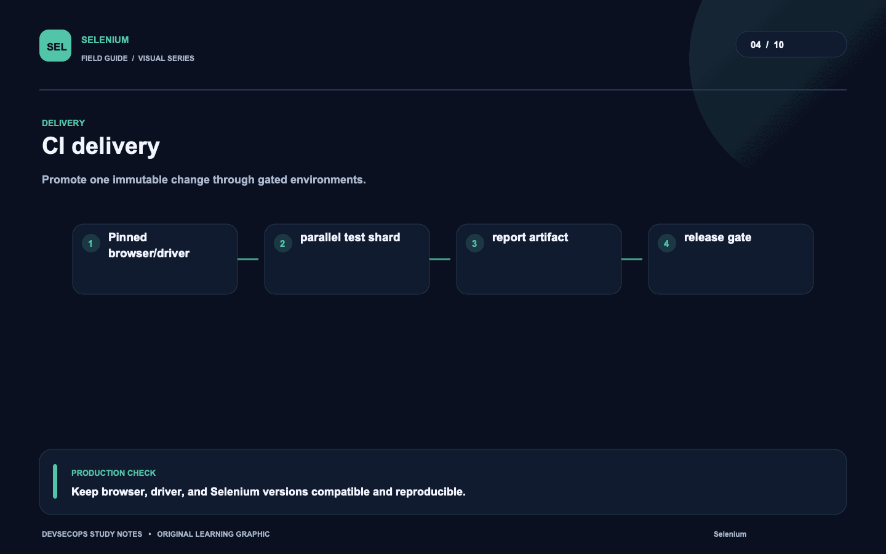
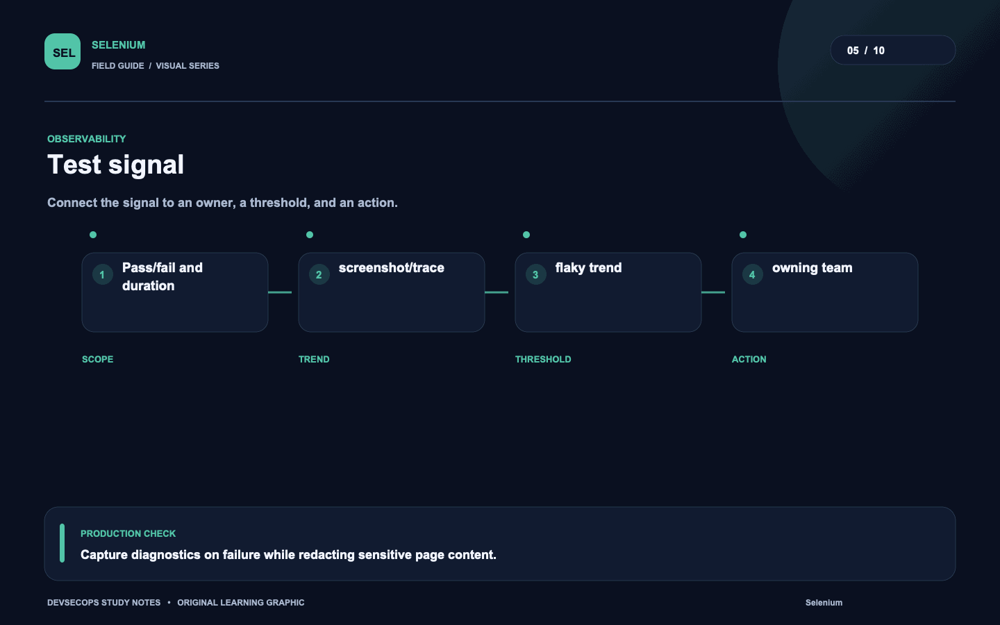
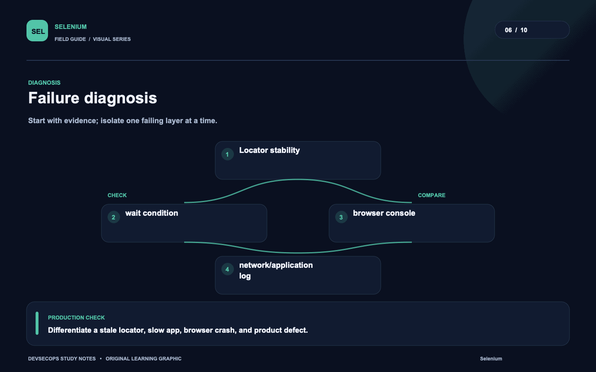
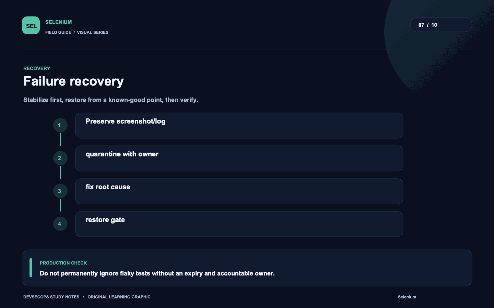
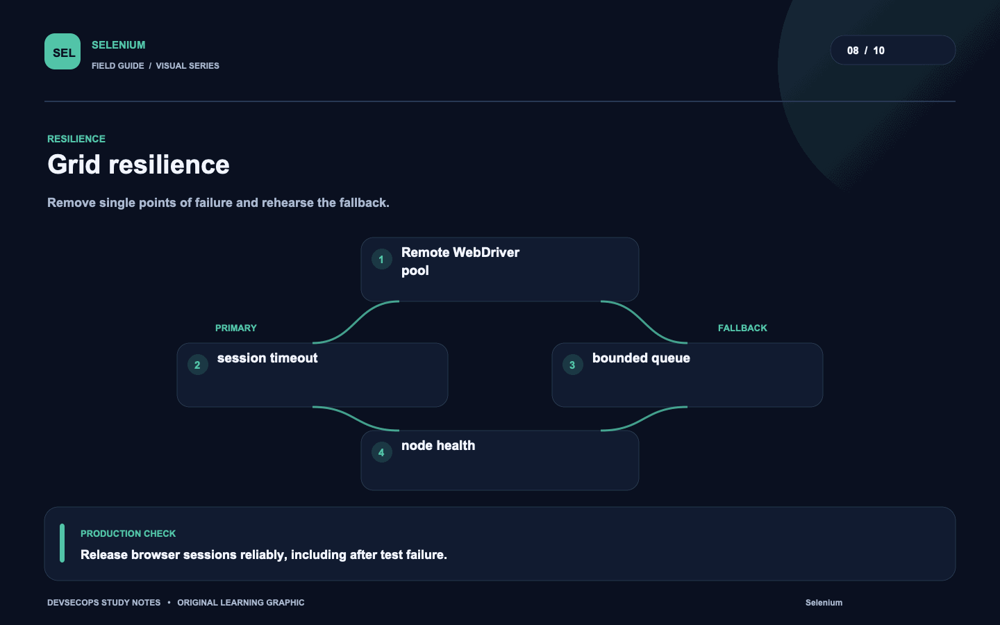
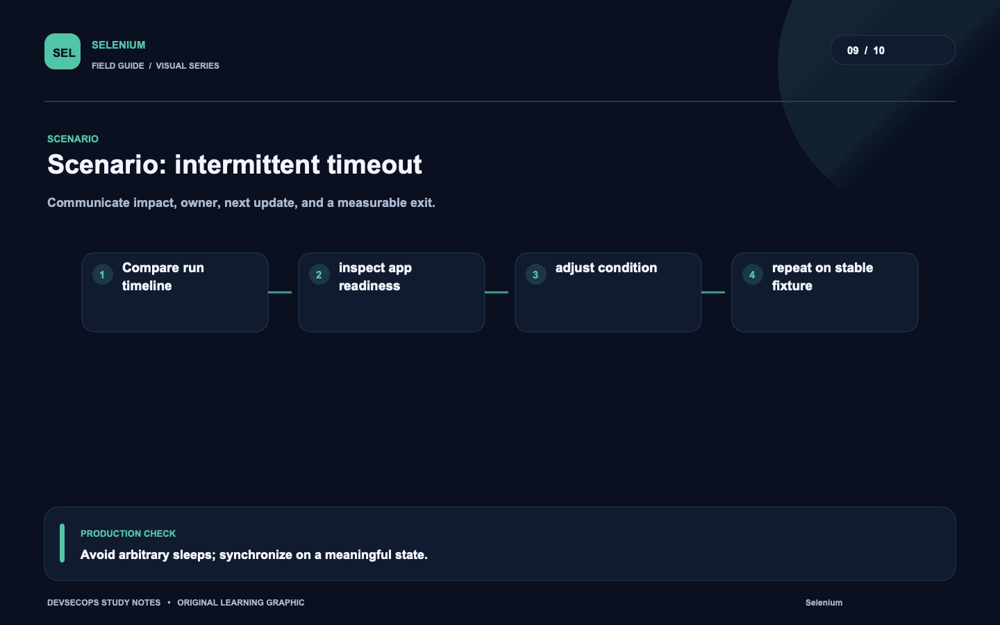
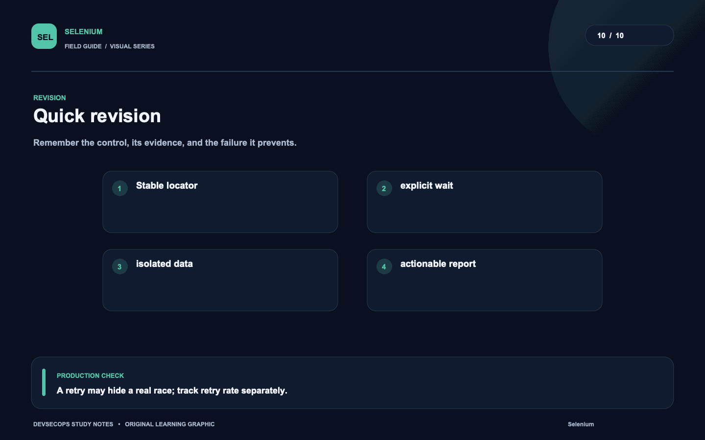

# Visual study cards

Ten original visuals for the [Selenium guide](../README.md). Open the SVG for a crisp, scalable version; use PNG for slides and quick viewing.

## 01. Browser test path

[SVG source](01-browser-test-path.svg) · [PNG image](01-browser-test-path.png)

## 02. Test lifecycle

[SVG source](02-test-lifecycle.svg) · [PNG image](02-test-lifecycle.png)

## 03. Test identity boundary

[SVG source](03-test-identity-boundary.svg) · [PNG image](03-test-identity-boundary.png)

## 04. CI delivery

[SVG source](04-ci-delivery.svg) · [PNG image](04-ci-delivery.png)

## 05. Test signal

[SVG source](05-test-signal.svg) · [PNG image](05-test-signal.png)

## 06. Failure diagnosis

[SVG source](06-failure-diagnosis.svg) · [PNG image](06-failure-diagnosis.png)

## 07. Failure recovery

[SVG source](07-failure-recovery.svg) · [PNG image](07-failure-recovery.png)

## 08. Grid resilience

[SVG source](08-grid-resilience.svg) · [PNG image](08-grid-resilience.png)

## 09. Scenario: intermittent timeout

[SVG source](09-scenario-intermittent-timeout.svg) · [PNG image](09-scenario-intermittent-timeout.png)

## 10. Quick revision

[SVG source](10-quick-revision.svg) · [PNG image](10-quick-revision.png)
