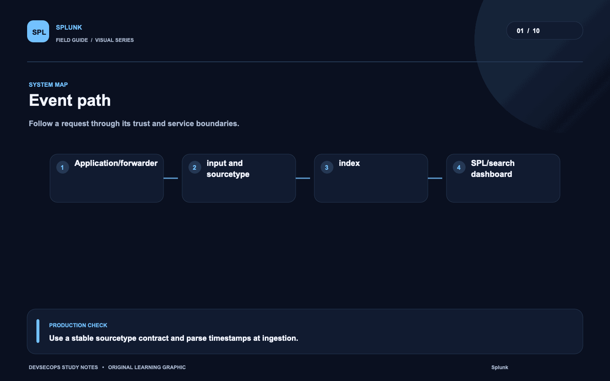
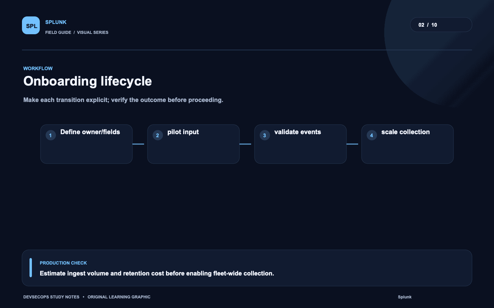
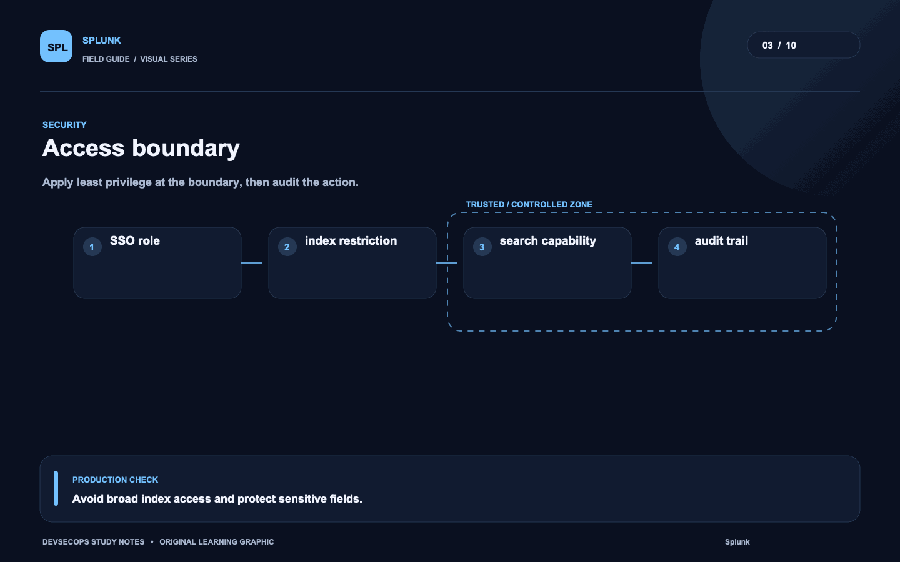
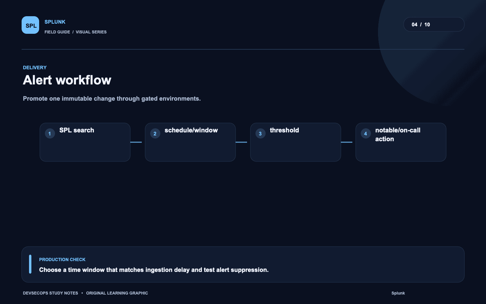
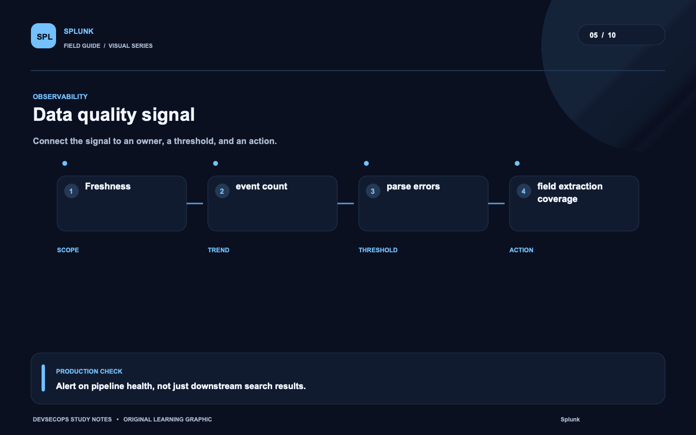
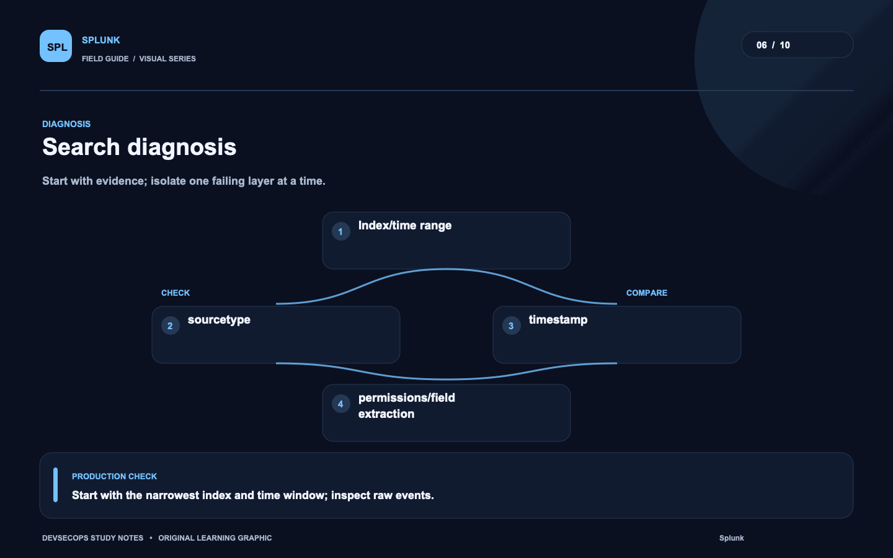
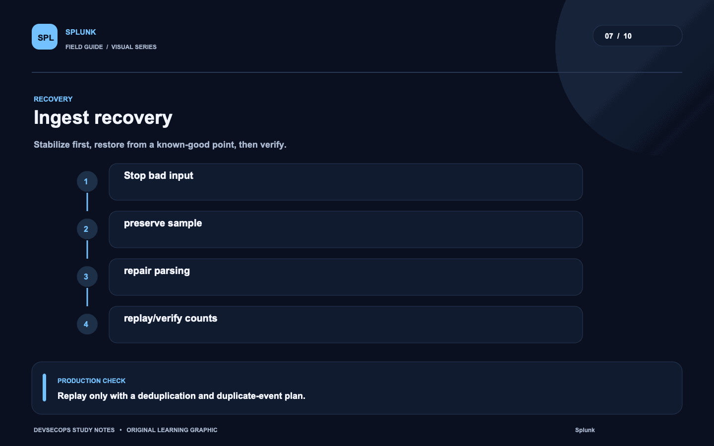
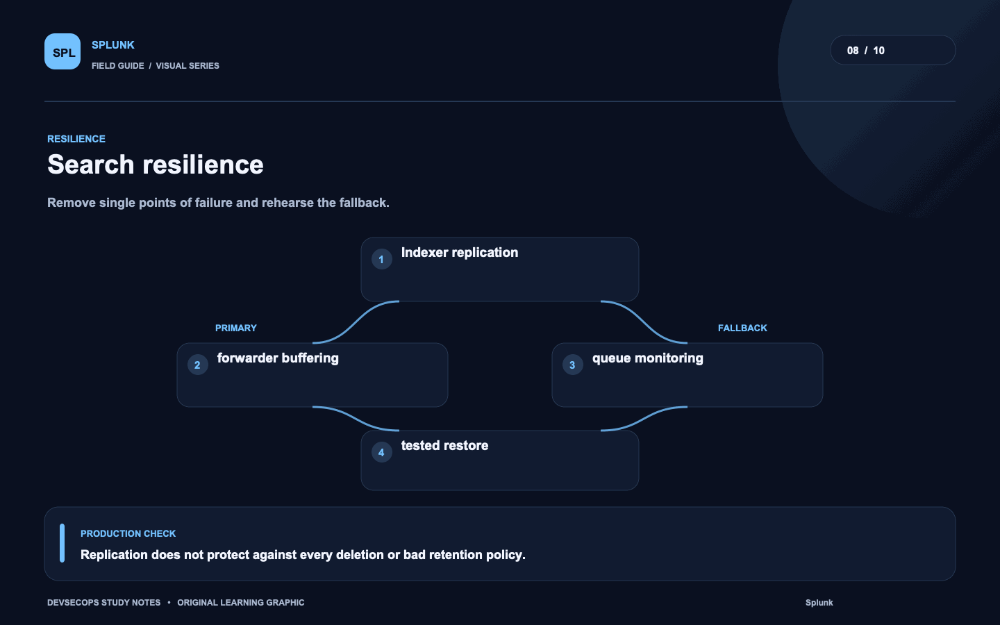
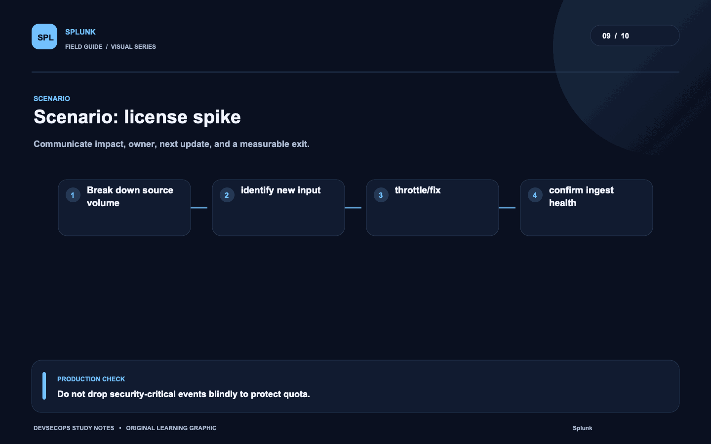
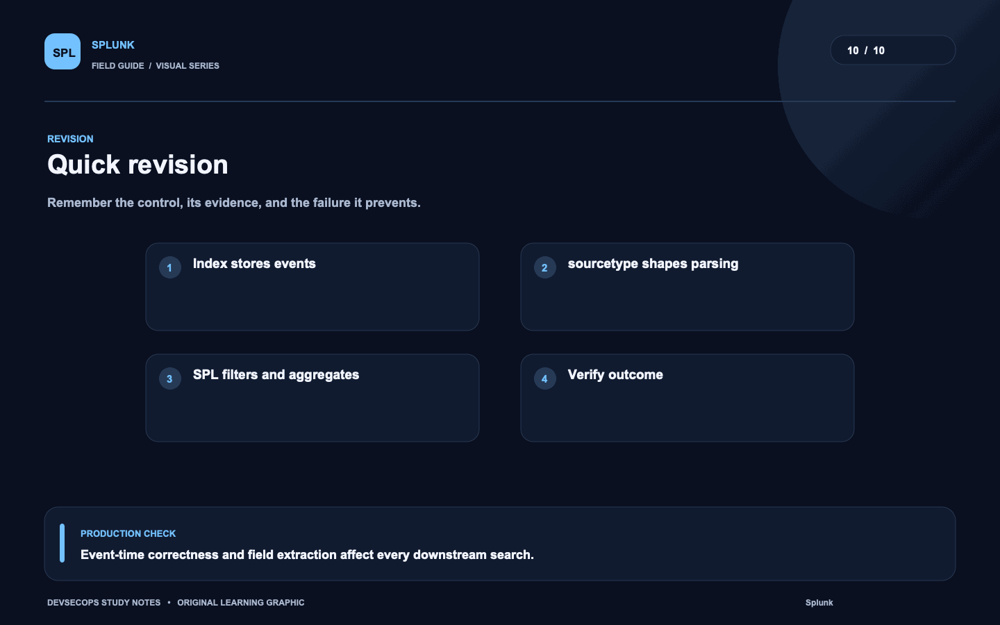

# Visual study cards

Ten original visuals for the [Splunk guide](../README.md). Open the SVG for a crisp, scalable version; use PNG for slides and quick viewing.

## 01. Event path

[SVG source](01-event-path.svg) · [PNG image](01-event-path.png)

## 02. Onboarding lifecycle

[SVG source](02-onboarding-lifecycle.svg) · [PNG image](02-onboarding-lifecycle.png)

## 03. Access boundary

[SVG source](03-access-boundary.svg) · [PNG image](03-access-boundary.png)

## 04. Alert workflow

[SVG source](04-alert-workflow.svg) · [PNG image](04-alert-workflow.png)

## 05. Data quality signal

[SVG source](05-data-quality-signal.svg) · [PNG image](05-data-quality-signal.png)

## 06. Search diagnosis

[SVG source](06-search-diagnosis.svg) · [PNG image](06-search-diagnosis.png)

## 07. Ingest recovery

[SVG source](07-ingest-recovery.svg) · [PNG image](07-ingest-recovery.png)

## 08. Search resilience

[SVG source](08-search-resilience.svg) · [PNG image](08-search-resilience.png)

## 09. Scenario: license spike

[SVG source](09-scenario-license-spike.svg) · [PNG image](09-scenario-license-spike.png)

## 10. Quick revision

[SVG source](10-quick-revision.svg) · [PNG image](10-quick-revision.png)
