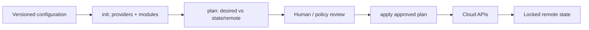

# Terraform for infrastructure as code

## Mental model

Terraform compares configuration, provider observations, and state to produce a plan. State maps configuration resources to real objects and can contain sensitive values; it is operationally critical. Providers translate Terraform resources into API operations. A plan is a proposed change, not proof that the provider or remote system will succeed.

## Safe workflow

1. Pin Terraform and provider versions; commit dependency lock files.
2. Format, validate, and review changes.
3. Use remote state with locking, encryption, access control, and recovery.
4. Generate and review a plan in the target environment.
5. Apply the reviewed plan, then inspect drift and outputs.

Organize reusable modules around stable interfaces, with typed variables, validation, and clear outputs. Separate environments/state boundaries according to ownership and blast radius. Avoid broad `*` permissions and hard-coded secrets. Marking a value sensitive hides some CLI output but does not remove it from state. Use a secret manager and tightly restrict state access.

## Drift and lifecycle

Treat state manipulation commands as hazardous: understand imports, moves, refreshes, and state removal before acting. Back up state and coordinate concurrent operations. Avoid routine `-target` usage because it can leave partial infrastructure. Make resources replaceable, plan destructive changes carefully, and use policy/scanning for insecure configurations.

## Practice

Provision a minimal network and workload in a sandbox. Review a plan containing a replacement, import a pre-existing resource, and demonstrate how state locking prevents concurrent applies.

## Further reading

[Terraform documentation](https://developer.hashicorp.com/terraform/docs) · [State](https://developer.hashicorp.com/terraform/language/state)

## Topic roadmap, example, and plan diagnosis

**Language:** providers configure APIs; resources create/manage objects; data sources read existing objects; variables define inputs; locals name derived values; outputs expose selected results; modules package reusable configuration. Dependencies usually derive from references; explicit `depends_on` is for hidden ordering requirements, not a default.

**Example:** pin a provider range and commit `.terraform.lock.hcl`; store state in a remote backend with encryption, access control, versioning/backup, and locking. A workspace is not automatically an environment security boundary. Use separate state/backends or accounts when stronger blast-radius separation is needed.

**Troubleshooting:** perpetual diff—provider normalization, unstable computed values, or external drift; lock timeout—identify active run and backend lease before force-unlocking; replacement plan—inspect `forces replacement` attributes, lifecycle rules, and data impact; missing resource in state—check workspace/backend/credentials before importing.

**Revision:** configuration describes; state maps; plan previews; apply mutates; lock prevents concurrent state operations; sensitive output redaction does not remove values from state; import associates existing object; `moved` preserves address changes; target is exceptional recovery, not routine deployment.

## GCP foundation lab

See [`examples/gcp-foundation/`](examples/gcp-foundation/) for a plan-only VPC/subnet/firewall example with typed variables and a required review step. It assumes an existing sandbox project and intentionally does not run apply. It is a learning module, not a landing zone; production also requires governed remote state, IAM, audit, policies, quotas, and network ownership.
