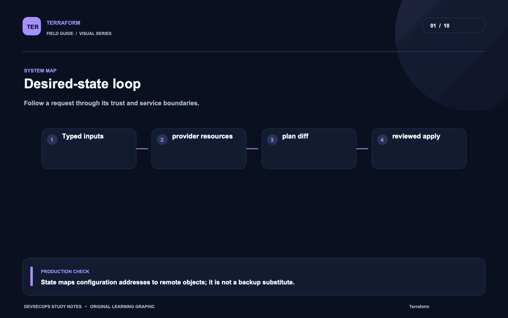
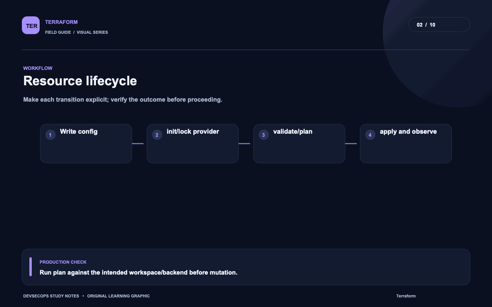
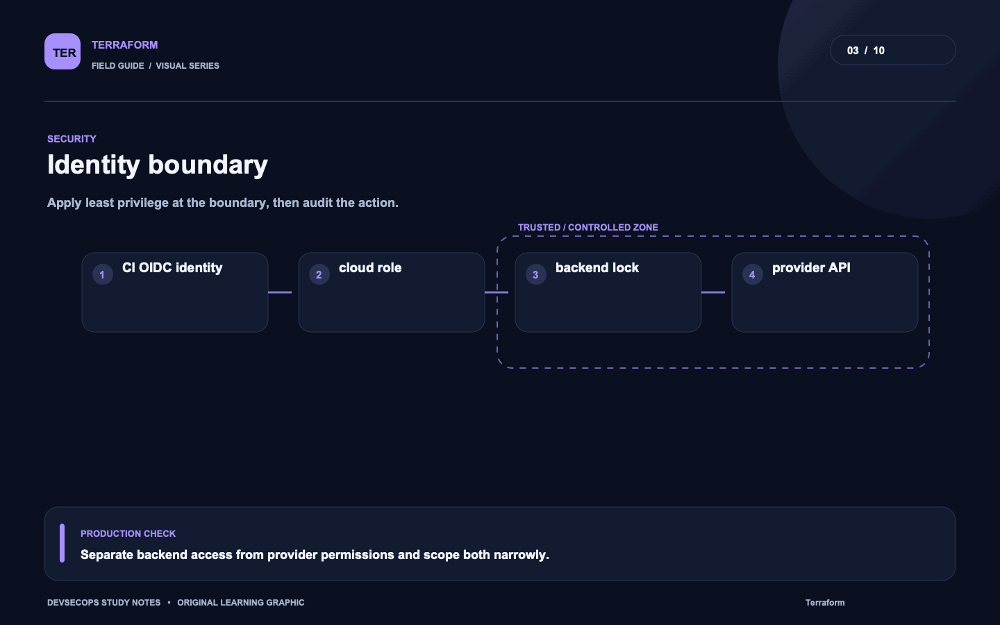
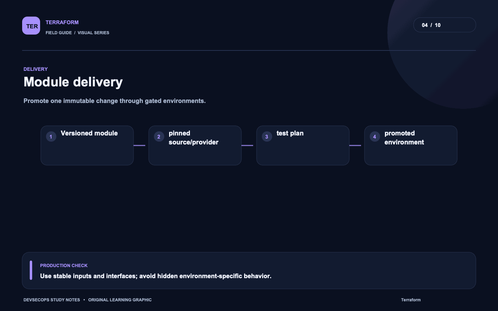
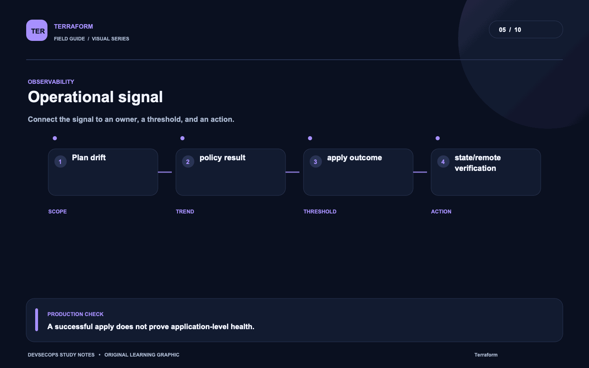
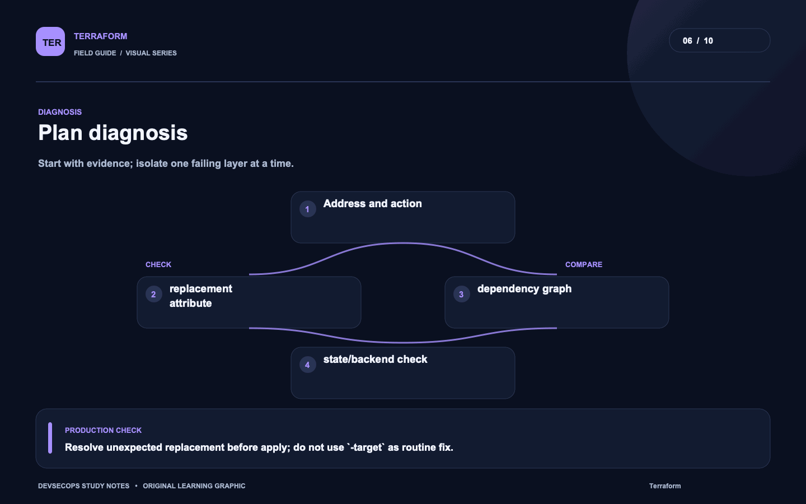
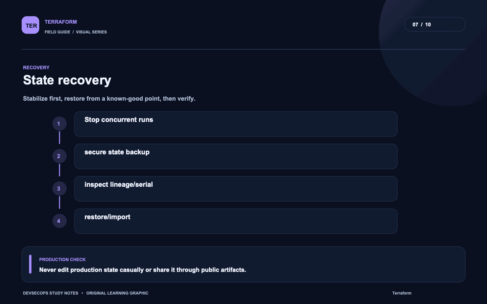
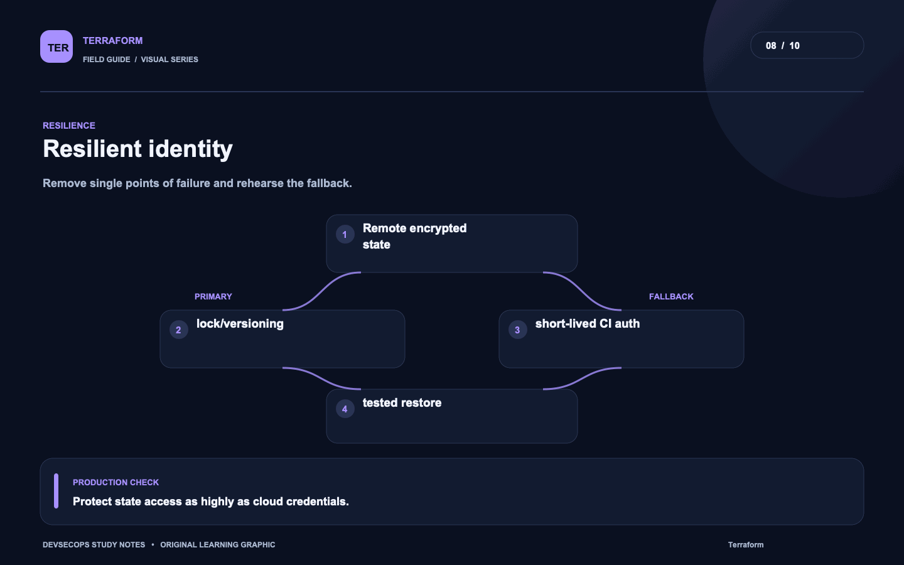
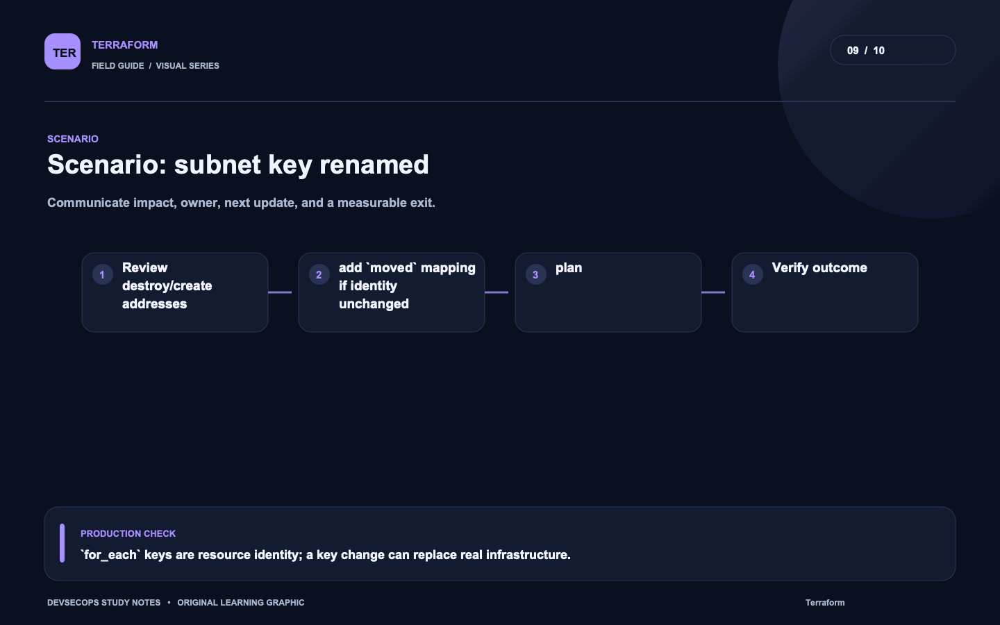
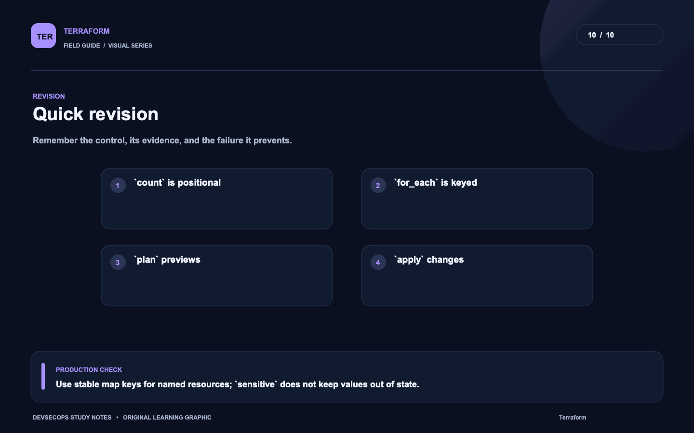

# Visual study cards

Ten original visuals for the [Terraform guide](../README.md). Open the SVG for a crisp, scalable version; use PNG for slides and quick viewing.

## 01. Desired-state loop

[SVG source](01-desired-state-loop.svg) · [PNG image](01-desired-state-loop.png)

## 02. Resource lifecycle

[SVG source](02-resource-lifecycle.svg) · [PNG image](02-resource-lifecycle.png)

## 03. Identity boundary

[SVG source](03-identity-boundary.svg) · [PNG image](03-identity-boundary.png)

## 04. Module delivery

[SVG source](04-module-delivery.svg) · [PNG image](04-module-delivery.png)

## 05. Operational signal

[SVG source](05-operational-signal.svg) · [PNG image](05-operational-signal.png)

## 06. Plan diagnosis

[SVG source](06-plan-diagnosis.svg) · [PNG image](06-plan-diagnosis.png)

## 07. State recovery

[SVG source](07-state-recovery.svg) · [PNG image](07-state-recovery.png)

## 08. Resilient identity

[SVG source](08-resilient-identity.svg) · [PNG image](08-resilient-identity.png)

## 09. Scenario: subnet key renamed

[SVG source](09-scenario-subnet-key-renamed.svg) · [PNG image](09-scenario-subnet-key-renamed.png)

## 10. Quick revision

[SVG source](10-quick-revision.svg) · [PNG image](10-quick-revision.png)
